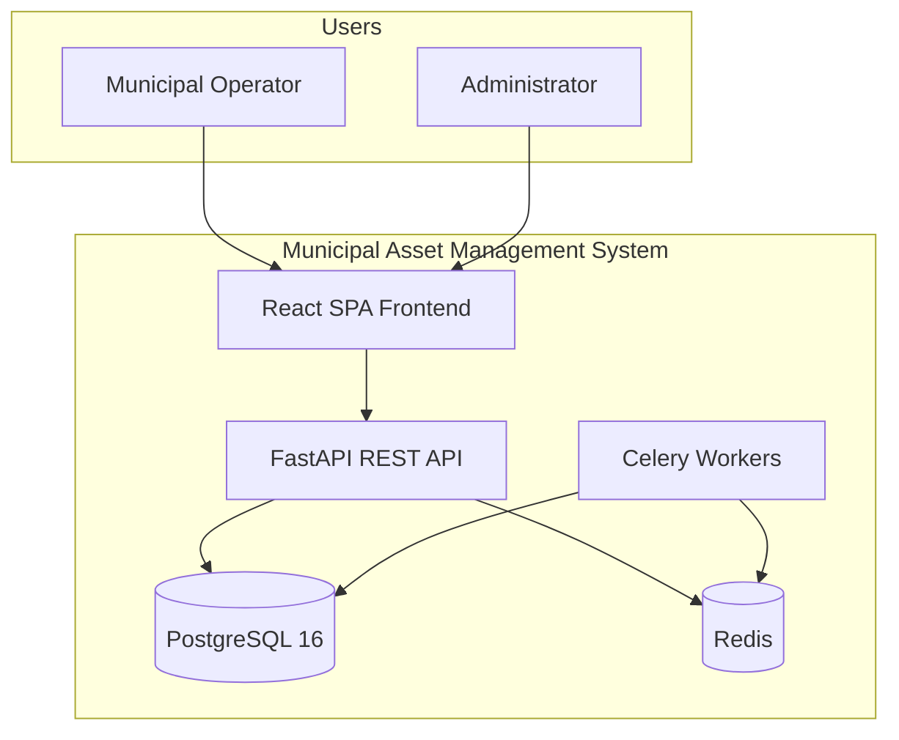
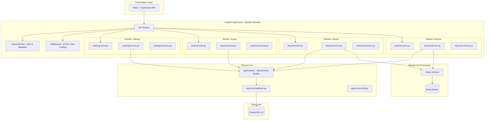
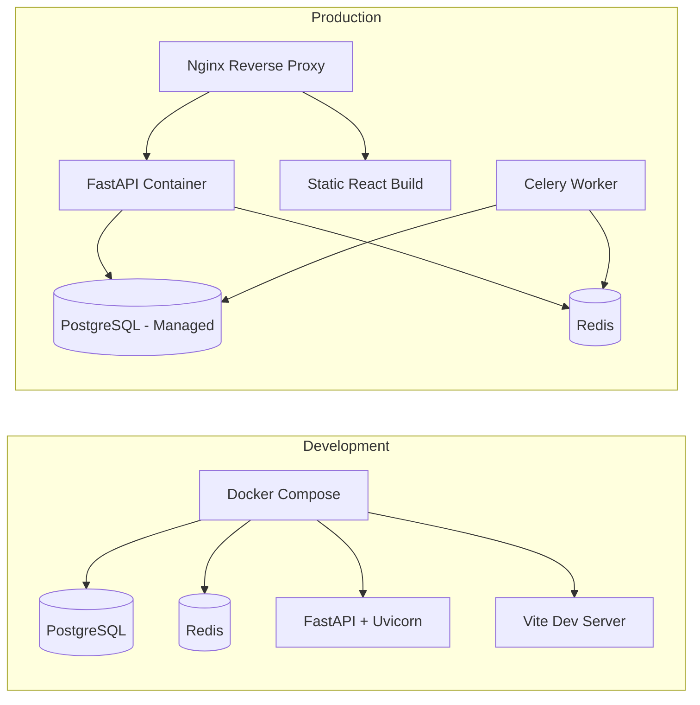
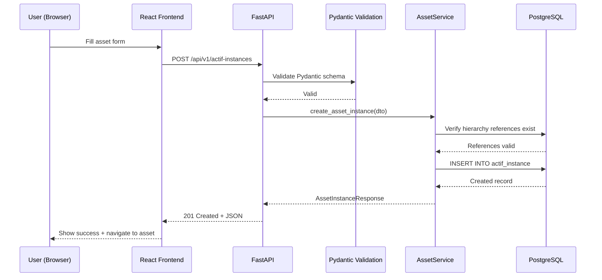
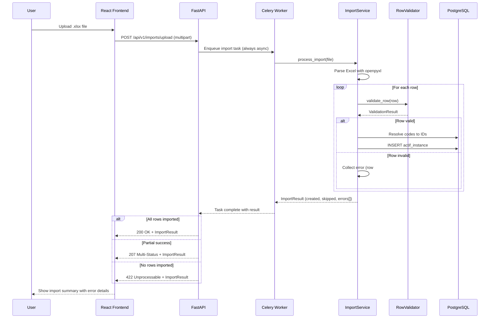
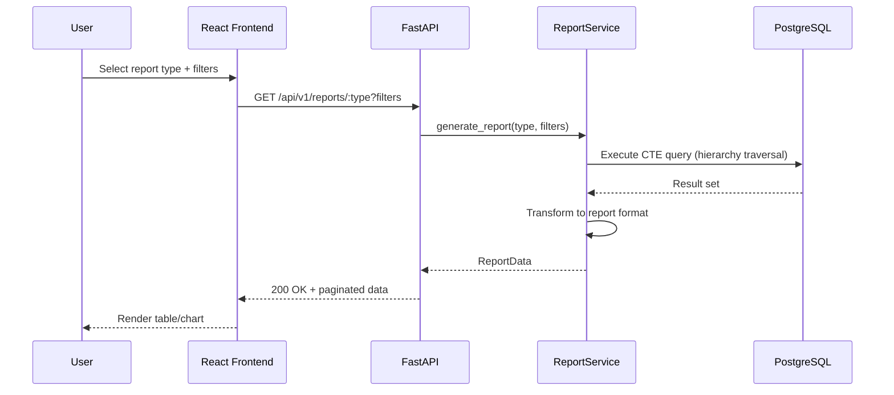

# Design Document: Municipal Asset Management System

## Overview

This document describes the complete technical design for rebuilding the municipal asset management POC into a production-ready, extensible system. The system manages municipal infrastructure assets (water systems, pumping stations, reservoirs, etc.) organized in a strict 8-level hierarchy from Service down to Actif tertiaire.

The V1 scope covers: manual asset data entry, Excel bulk import, general and specific reporting, and an architecture designed for future upgrades (lifecycle tracking, audit trails, multi-tenant domain management, user management, and RBAC). The design preserves French domain terminology throughout the data model while using English for code and documentation.

The recommended stack evolves the existing Node.js/PostgreSQL foundation into a typed, testable, and deployable system: **Python + FastAPI** (backend), **React + TypeScript** (frontend), **PostgreSQL 16** (database), **SQLAlchemy** (ORM), containerized with **Docker Compose** for development and deployable to any cloud via container orchestration.

## Architecture

### System Context



### Modular Monolith Architecture



### Technology Stack Recommendation

| Layer | Current POC | Recommended V1 | Justification |
|-------|-------------|-----------------|---------------|
| Frontend | HTML + vanilla JS | React + TypeScript + Vite | Type safety, component reuse, rich ecosystem for tables/forms/trees |
| Backend | Node.js + Express (JS) | Python + FastAPI | Async-native, auto-generated OpenAPI docs, Pydantic validation, excellent ecosystem for data processing |
| Database | PostgreSQL 16 | PostgreSQL 16 | Proven, excellent for hierarchical data (CTEs, JSONB), keep existing |
| ORM | Raw `pg` queries | SQLAlchemy (async) | Mature, flexible, supports raw SQL and ORM patterns, async support |
| Validation | None | Pydantic (built into FastAPI) | Automatic request/response validation, serialization, OpenAPI schema generation |
| Testing | None | pytest + hypothesis + httpx | Unit, integration, property-based testing with excellent Python ecosystem |
| Excel | Manual parsing | openpyxl (read) + xlsxwriter (write) | Streaming reads for large files, fast template generation |
| PDF | None | reportlab | Mature PDF generation library for Python |
| Background Tasks | None | Celery + Redis | Distributed task queue for large imports and PDF generation |
| Auth (V2) | Hardcoded session | python-jose + passlib | JWT tokens, password hashing |
| Deployment | Docker Compose (local) | Docker Compose (dev) + Docker + Nginx (prod) | Same containers, different orchestration |
| CI/CD | GitHub Actions (basic) | GitHub Actions (lint, test, build, deploy) | Already in place, extend it |
| Migrations | None | Alembic | SQLAlchemy-native migration tool, version-controlled schema changes |

### Deployment Architecture



## Sequence Diagrams

### Asset Manual Creation Flow



### Excel Import Flow



### Report Generation Flow



## Components and Interfaces

### Component 1: Asset Catalog Module

**Purpose**: Manages the global asset hierarchy (catalogue) — the reference taxonomy shared across all municipalities.

**Interface**:
```python
class CatalogService:
    """Manages the 8-level asset hierarchy catalog."""

    async def get_services(self) -> list[ActifServiceSchema]: ...
    async def get_fonctions(self, serv_code: str) -> list[ActifFonctionSchema]: ...
    async def get_sous_fonctions(self, fonc_code: str) -> list[SousFonctionSchema]: ...
    async def get_types_actif(self, sous_fonc_code: str) -> list[TypeActifSchema]: ...
    async def get_actifs_primaires(self, filters: PrimaireFilter) -> list[ActifPrimaireSchema]: ...
    async def get_actifs_secondaires(self, prim_code: str) -> list[ActifSecondaireSchema]: ...
    async def get_actifs_tertiaires(self, seco_code: str) -> list[ActifTertiaireSchema]: ...

    # Full tree retrieval
    async def get_hierarchy_tree(self, service_code: str | None = None) -> list[HierarchyNode]: ...

    # CRUD for catalog entries (admin only)
    async def create_catalog_entry(self, level: HierarchyLevel, dto: CreateCatalogDto) -> CatalogEntry: ...
    async def update_catalog_entry(self, level: HierarchyLevel, code: str, dto: UpdateCatalogDto) -> CatalogEntry: ...
    async def deactivate_catalog_entry(self, level: HierarchyLevel, code: str) -> None: ...
```

**Responsibilities**:
- Maintain referential integrity of the 8-level hierarchy
- Provide tree-structured navigation for the frontend
- Enforce unique codes per level
- Support soft-delete (end_date pattern) for catalog entries

### Component 2: Asset Instance Module

**Purpose**: Manages concrete asset instances — real physical assets belonging to a specific municipality/unit.

**Interface**:
```python
class AssetInstanceService:
    """Manages physical asset instances."""

    async def create(self, dto: CreateAssetInstanceDto) -> AssetInstance: ...
    async def find_by_id(self, instance_id: int) -> AssetInstance | None: ...
    async def find_all(self, filters: AssetInstanceFilter) -> PaginatedResult[AssetInstance]: ...
    async def update(self, instance_id: int, dto: UpdateAssetInstanceDto) -> AssetInstance: ...
    async def deactivate(self, instance_id: int) -> None: ...

    # Hierarchy-aware queries
    async def find_by_hierarchy_path(self, path: HierarchyPath) -> list[AssetInstance]: ...
    async def get_instance_count(self, group_by: HierarchyLevel) -> list[CountByLevel]: ...
```

**Responsibilities**:
- CRUD operations on physical asset records
- Enforce that each instance references exactly one catalog level (primaire XOR secondaire XOR tertiaire)
- Validate all foreign key references before insert
- Support filtering by any combination of hierarchy levels, tenant, and attributes

### Component 3: Import Module

**Purpose**: Handles Excel file parsing, validation, code resolution, and bulk insertion of asset instances.

**Interface**:
```python
class ImportService:
    """Handles Excel import processing."""

    async def process_import(self, file: bytes, options: ImportOptions) -> ImportResult: ...
    async def validate_template(self, file: bytes) -> TemplateValidation: ...
    async def get_template(self) -> bytes: ...
    async def get_import_history(self, filters: ImportHistoryFilter) -> list[ImportRecord]: ...


@dataclass
class ImportOptions:
    tenant_ville_id: int
    tenant_unite_id: int | None = None
    dry_run: bool = False          # Validate without inserting
    skip_duplicates: bool = True


@dataclass
class ImportResult:
    total_rows: int
    created: int
    skipped: int
    errors: list[ImportError]
    duration_ms: int


@dataclass
class ImportError:
    row: int
    column: str
    value: str | None
    message: str
    severity: Literal["error", "warning"]
```

**Responsibilities**:
- Stream-parse Excel files (handle large files without memory issues)
- Validate each row against the catalog hierarchy
- Resolve human-readable codes to internal IDs
- Provide dry-run mode for validation without side effects
- Return detailed error reports with row/column references
- Record import history for audit purposes

### Component 4: Report Module

**Purpose**: Generates general and specific reports on assets with filtering, grouping, and export capabilities.

**Interface**:
```python
class ReportService:
    """Generates reports and exports."""

    # Pre-defined report types
    async def get_asset_inventory(self, filters: ReportFilter) -> PaginatedResult[AssetRow]: ...
    async def get_assets_by_hierarchy(self, level: HierarchyLevel, filters: ReportFilter) -> GroupedReport: ...
    async def get_asset_count_summary(self, filters: ReportFilter) -> SummaryReport: ...

    # Export
    async def export_to_excel(self, report_type: ReportType, filters: ReportFilter) -> bytes: ...
    async def export_to_pdf(self, report_type: ReportType, filters: ReportFilter) -> bytes: ...


@dataclass
class ReportFilter:
    service_code: str | None = None
    fonction_code: str | None = None
    sous_fonction_code: str | None = None
    type_actif_code: str | None = None
    tenant_ville_id: int | None = None
    tenant_unite_id: int | None = None
    discipline: str | None = None
    installation_date_from: date | None = None
    installation_date_to: date | None = None
    search: str | None = None       # Full-text search on name/code
    page: int = 1
    page_size: int = 25
    sort_by: str = "instance_code"
    sort_order: Literal["asc", "desc"] = "asc"
```

**Responsibilities**:
- Execute optimized queries using PostgreSQL CTEs for hierarchy traversal
- Support pagination, sorting, and full-text search
- Generate Excel (xlsxwriter) and PDF (reportlab) exports
- Delegate heavy exports to Celery workers
- Cache frequently-used aggregations

## Data Models

### Asset Hierarchy (Catalog) — SQLAlchemy Models

```python
# The 8-level hierarchy: Service → Fonction → Sous-fonction → Type d'actif
#   → Actif primaire → Discipline → Actif secondaire → Actif tertiaire

class ActifService(Base):
    __tablename__ = "actif_service"

    serv_code: Mapped[str] = mapped_column(String(50), primary_key=True)  # e.g., "EP" (Eau potable)
    serv_nom: Mapped[str] = mapped_column(String(255))                    # e.g., "Eau potable"
    fami_code: Mapped[str] = mapped_column(ForeignKey("actif_famille.fami_code"))
    is_active: Mapped[bool] = mapped_column(default=True)
    created_at: Mapped[datetime] = mapped_column(default=func.now())
    end_date: Mapped[datetime | None] = mapped_column(nullable=True)

    famille: Mapped["ActifFamille"] = relationship(back_populates="services")
    fonctions: Mapped[list["ActifFonction"]] = relationship(back_populates="service")


class ActifFonction(Base):
    __tablename__ = "actif_fonction"

    fonc_code: Mapped[str] = mapped_column(String(50), primary_key=True)  # e.g., "DIST"
    fonc_nom: Mapped[str] = mapped_column(String(255))                    # e.g., "Distribution"
    serv_code: Mapped[str] = mapped_column(ForeignKey("actif_service.serv_code"))
    is_active: Mapped[bool] = mapped_column(default=True)
    created_at: Mapped[datetime] = mapped_column(default=func.now())
    end_date: Mapped[datetime | None] = mapped_column(nullable=True)

    service: Mapped["ActifService"] = relationship(back_populates="fonctions")
    sous_fonctions: Mapped[list["SousFonction"]] = relationship(back_populates="fonction")


class SousFonction(Base):
    __tablename__ = "sous_fonction"

    sous_fonc_code: Mapped[str] = mapped_column(String(50), primary_key=True)  # e.g., "RES_DIST"
    sous_fonc_nom: Mapped[str] = mapped_column(String(255))
    fonc_code: Mapped[str] = mapped_column(ForeignKey("actif_fonction.fonc_code"))
    is_active: Mapped[bool] = mapped_column(default=True)
    created_at: Mapped[datetime] = mapped_column(default=func.now())
    end_date: Mapped[datetime | None] = mapped_column(nullable=True)

    fonction: Mapped["ActifFonction"] = relationship(back_populates="sous_fonctions")
    types_actif: Mapped[list["TypeActif"]] = relationship(back_populates="sous_fonction")


class TypeActif(Base):
    __tablename__ = "type_actif"

    type_actif_code: Mapped[str] = mapped_column(String(50), primary_key=True)
    type_actif_nom: Mapped[str] = mapped_column(String(255))
    sous_fonc_code: Mapped[str] = mapped_column(ForeignKey("sous_fonction.sous_fonc_code"))
    is_active: Mapped[bool] = mapped_column(default=True)
    created_at: Mapped[datetime] = mapped_column(default=func.now())
    end_date: Mapped[datetime | None] = mapped_column(nullable=True)

    sous_fonction: Mapped["SousFonction"] = relationship(back_populates="types_actif")
    primaires: Mapped[list["ActifPrimaire"]] = relationship(back_populates="type_actif")
```

```python
class ActifDiscipline(Base):
    __tablename__ = "actif_discipline"

    disc_code: Mapped[str] = mapped_column(String(50), primary_key=True)  # e.g., "MEC"
    disc_nom: Mapped[str] = mapped_column(String(255))                    # e.g., "Mécanique"

    secondaires: Mapped[list["ActifSecondaire"]] = relationship(back_populates="discipline")


class ActifPrimaire(Base):
    __tablename__ = "actif_primaire"

    prim_code: Mapped[str] = mapped_column(String(50), primary_key=True)
    prim_nom: Mapped[str] = mapped_column(String(255))
    type_actif_code: Mapped[str] = mapped_column(ForeignKey("type_actif.type_actif_code"))
    fonc_code: Mapped[str] = mapped_column(String(50))       # Denormalized for query perf
    serv_code: Mapped[str] = mapped_column(String(50))       # Denormalized for query perf
    is_active: Mapped[bool] = mapped_column(default=True)
    created_at: Mapped[datetime] = mapped_column(default=func.now())
    end_date: Mapped[datetime | None] = mapped_column(nullable=True)

    type_actif: Mapped["TypeActif"] = relationship(back_populates="primaires")
    secondaires: Mapped[list["ActifSecondaire"]] = relationship(back_populates="primaire")
    instances: Mapped[list["ActifInstance"]] = relationship(back_populates="primaire")


class ActifSecondaire(Base):
    __tablename__ = "actif_secondaire"

    seco_code: Mapped[str] = mapped_column(String(50), primary_key=True)
    seco_nom: Mapped[str] = mapped_column(String(255))
    prim_code: Mapped[str] = mapped_column(ForeignKey("actif_primaire.prim_code"))
    disc_code: Mapped[str] = mapped_column(ForeignKey("actif_discipline.disc_code"))
    is_active: Mapped[bool] = mapped_column(default=True)
    created_at: Mapped[datetime] = mapped_column(default=func.now())
    end_date: Mapped[datetime | None] = mapped_column(nullable=True)

    primaire: Mapped["ActifPrimaire"] = relationship(back_populates="secondaires")
    discipline: Mapped["ActifDiscipline"] = relationship(back_populates="secondaires")
    tertiaires: Mapped[list["ActifTertiaire"]] = relationship(back_populates="secondaire")
    instances: Mapped[list["ActifInstance"]] = relationship(back_populates="secondaire")


class ActifTertiaire(Base):
    __tablename__ = "actif_tertiaire"

    tert_code: Mapped[str] = mapped_column(String(50), primary_key=True)
    tert_nom: Mapped[str] = mapped_column(String(255))
    seco_code: Mapped[str] = mapped_column(ForeignKey("actif_secondaire.seco_code"))
    is_active: Mapped[bool] = mapped_column(default=True)
    created_at: Mapped[datetime] = mapped_column(default=func.now())
    end_date: Mapped[datetime | None] = mapped_column(nullable=True)

    secondaire: Mapped["ActifSecondaire"] = relationship(back_populates="tertiaires")
    instances: Mapped[list["ActifInstance"]] = relationship(back_populates="tertiaire")
```

**Validation Rules**:
- All `*_code` fields: uppercase alphanumeric + underscore, max 50 chars
- All `*_nom` fields: non-empty, max 255 chars
- Foreign keys must reference active (non-ended) parent records
- Codes are immutable after creation (rename creates new + deactivates old)
- `end_date` set means soft-deleted; queries filter by `end_date IS NULL` by default

### Asset Instance (Physical Assets)

```python
class ActifInstance(Base):
    __tablename__ = "actif_instance"

    instance_id: Mapped[int] = mapped_column(primary_key=True, autoincrement=True)
    instance_code: Mapped[str] = mapped_column(String(50))
    instance_nom: Mapped[str] = mapped_column(String(255))

    # Exactly ONE of these must be set (XOR constraint via CHECK)
    prim_code: Mapped[str | None] = mapped_column(ForeignKey("actif_primaire.prim_code"), nullable=True)
    seco_code: Mapped[str | None] = mapped_column(ForeignKey("actif_secondaire.seco_code"), nullable=True)
    tert_code: Mapped[str | None] = mapped_column(ForeignKey("actif_tertiaire.tert_code"), nullable=True)

    # Tenant (municipality)
    tenant_ville_id: Mapped[int] = mapped_column(ForeignKey("tenant_ville.tenant_ville_id"))
    tenant_unite_id: Mapped[int | None] = mapped_column(ForeignKey("tenant_unite.tenant_unite_id"), nullable=True)

    # Physical attributes (flexible, asset-type dependent)
    installation_date: Mapped[date | None] = mapped_column(Date, nullable=True)
    serial_number: Mapped[str | None] = mapped_column(String(120), nullable=True)
    attributes: Mapped[dict | None] = mapped_column(JSONB, nullable=True)  # Type-specific fields

    # Metadata
    status_code: Mapped[str] = mapped_column(String(50), default="ACTIF")
    notes: Mapped[str | None] = mapped_column(Text, nullable=True)
    created_at: Mapped[datetime] = mapped_column(default=func.now())
    updated_at: Mapped[datetime] = mapped_column(default=func.now(), onupdate=func.now())
    end_date: Mapped[datetime | None] = mapped_column(nullable=True)

    # Relationships
    primaire: Mapped["ActifPrimaire | None"] = relationship(back_populates="instances")
    secondaire: Mapped["ActifSecondaire | None"] = relationship(back_populates="instances")
    tertiaire: Mapped["ActifTertiaire | None"] = relationship(back_populates="instances")
    ville: Mapped["TenantVille"] = relationship(back_populates="instances")
    unite: Mapped["TenantUnite | None"] = relationship(back_populates="instances")

    __table_args__ = (
        UniqueConstraint("instance_code", "tenant_ville_id"),
        CheckConstraint(
            "(prim_code IS NOT NULL)::int + (seco_code IS NOT NULL)::int + (tert_code IS NOT NULL)::int = 1",
            name="ck_exactly_one_catalog_ref"
        ),
    )
```

**Validation Rules**:
- Exactly one of `prim_code`, `seco_code`, `tert_code` must be non-null (CHECK constraint)
- `instance_code` must be unique within a `tenant_ville_id`
- `tenant_ville_id` is always required
- `attributes` JSONB validated against a schema per asset type (V2: JSON Schema validation)
- `status_code` must be from allowed enum values

### Tenant Model (Multi-Municipality)

```python
class TenantVille(Base):
    __tablename__ = "tenant_ville"

    tenant_ville_id: Mapped[int] = mapped_column(primary_key=True, autoincrement=True)
    tenant_code: Mapped[str] = mapped_column(String(50), unique=True)   # e.g., "MTL", "QC"
    tenant_nom: Mapped[str] = mapped_column(String(255))                # e.g., "Ville de Montréal"
    is_active: Mapped[bool] = mapped_column(default=True)
    created_at: Mapped[datetime] = mapped_column(default=func.now())
    updated_at: Mapped[datetime] = mapped_column(default=func.now(), onupdate=func.now())
    end_date: Mapped[datetime | None] = mapped_column(nullable=True)

    unites: Mapped[list["TenantUnite"]] = relationship(back_populates="ville")
    instances: Mapped[list["ActifInstance"]] = relationship(back_populates="ville")
    imports: Mapped[list["ImportRecord"]] = relationship(back_populates="ville")


class TenantUnite(Base):
    __tablename__ = "tenant_unite"

    tenant_unite_id: Mapped[int] = mapped_column(primary_key=True, autoincrement=True)
    tenant_ville_id: Mapped[int] = mapped_column(ForeignKey("tenant_ville.tenant_ville_id"))
    unite_code: Mapped[str] = mapped_column(String(50), unique=True)
    unite_nom: Mapped[str] = mapped_column(String(255))
    unite_location: Mapped[str | None] = mapped_column(String(255), nullable=True)
    categorie_code: Mapped[str | None] = mapped_column(String(50), nullable=True)
    is_active: Mapped[bool] = mapped_column(default=True)
    created_at: Mapped[datetime] = mapped_column(default=func.now())
    updated_at: Mapped[datetime] = mapped_column(default=func.now(), onupdate=func.now())
    end_date: Mapped[datetime | None] = mapped_column(nullable=True)

    ville: Mapped["TenantVille"] = relationship(back_populates="unites")
    instances: Mapped[list["ActifInstance"]] = relationship(back_populates="unite")
```

### Import Record (Audit)

```python
class ImportRecord(Base):
    __tablename__ = "import_record"

    import_id: Mapped[int] = mapped_column(primary_key=True, autoincrement=True)
    tenant_ville_id: Mapped[int] = mapped_column(ForeignKey("tenant_ville.tenant_ville_id"))
    filename: Mapped[str] = mapped_column(String(255))
    file_hash: Mapped[str] = mapped_column(String(64))          # SHA-256 for dedup detection
    total_rows: Mapped[int]
    created_count: Mapped[int]
    skipped_count: Mapped[int]
    error_count: Mapped[int]
    errors_json: Mapped[dict | None] = mapped_column(JSONB, nullable=True)
    status: Mapped[str] = mapped_column(String(20))             # 'completed' | 'partial' | 'failed'
    imported_by: Mapped[str] = mapped_column(String(100))       # Username (V2: user_id FK)
    started_at: Mapped[datetime] = mapped_column(default=func.now())
    completed_at: Mapped[datetime | None] = mapped_column(nullable=True)

    ville: Mapped["TenantVille"] = relationship(back_populates="imports")
```

## Pydantic Schemas (Request/Response Validation)

```python
from pydantic import BaseModel, Field, field_validator
from datetime import date, datetime
from typing import Any


class CreateAssetInstanceDto(BaseModel):
    instance_code: str = Field(..., min_length=1, max_length=50, pattern=r"^[A-Za-z0-9_\-]+$")
    instance_nom: str = Field(..., min_length=1, max_length=255)
    prim_code: str | None = None
    seco_code: str | None = None
    tert_code: str | None = None
    tenant_ville_id: int
    tenant_unite_id: int | None = None
    installation_date: date | None = None
    serial_number: str | None = Field(None, max_length=120)
    attributes: dict[str, Any] | None = None
    notes: str | None = None

    @field_validator("prim_code", "seco_code", "tert_code")
    @classmethod
    def validate_catalog_ref(cls, v, info):
        """Ensure exactly one catalog reference is set (validated at model level)."""
        return v


class AssetInstanceResponse(BaseModel):
    instance_id: int
    instance_code: str
    instance_nom: str
    prim_code: str | None
    seco_code: str | None
    tert_code: str | None
    tenant_ville_id: int
    tenant_unite_id: int | None
    installation_date: date | None
    serial_number: str | None
    attributes: dict[str, Any] | None
    status_code: str
    notes: str | None
    created_at: datetime
    updated_at: datetime

    model_config = {"from_attributes": True}


class PaginatedResult(BaseModel):
    data: list[Any]
    total: int
    page: int
    page_size: int
    total_pages: int
```

## Key Functions with Formal Specifications

### Function 1: process_excel_import()

```python
async def process_excel_import(
    file: bytes,
    options: ImportOptions,
    db: AsyncSession,
) -> ImportResult:
    ...
```

**Preconditions:**
- `file` is a valid .xlsx buffer (magic bytes check)
- `len(file) <= 50MB` (configurable max)
- `options.tenant_ville_id` references an active tenant
- The file contains a sheet with expected column headers

**Postconditions:**
- Returns `ImportResult` with accurate counts: `created + skipped + len(errors) == total_rows`
- If `options.dry_run is True`: no database mutations occur, result reflects what would happen
- All created instances have valid hierarchy references
- All created instances belong to `options.tenant_ville_id`
- An `ImportRecord` audit entry is persisted (even for dry runs)
- No partial state: uses database transaction (all-or-nothing per batch)

**Loop Invariants:**
- At any point during row processing: `processed_count == created + skipped + len(errors)`
- Memory usage stays bounded (streaming parser, batch inserts of 100 rows)

### Function 2: resolve_hierarchy_codes()

```python
async def resolve_hierarchy_codes(
    row: ImportRow,
    db: AsyncSession,
) -> ResolvedRow | ResolutionError:
    ...
```

**Preconditions:**
- `row` has at least one of: `prim_code`, `seco_code`, `tert_code`
- `row.service_code` is provided and non-empty

**Postconditions:**
- If successful: all codes in `ResolvedRow` map to active catalog entries
- If successful: the hierarchy path is consistent (tertiaire → secondaire → primaire → type → sous-fonction → fonction → service)
- If error: `ResolutionError` identifies which code failed and why
- No side effects (pure lookup function)

**Loop Invariants:** N/A (single-row operation)

### Function 3: build_hierarchy_tree()

```python
async def build_hierarchy_tree(
    root_service_code: str | None = None,
    db: AsyncSession = ...,
) -> list[HierarchyNode]:
    ...
```

**Preconditions:**
- If `root_service_code` provided: it must reference an active service
- Database connection is available

**Postconditions:**
- Returns a tree where each node's children are the next hierarchy level
- All returned nodes have `end_date IS NULL` (active only)
- Tree depth is exactly 7 levels (Service → ... → Tertiaire) when fully populated
- No circular references (guaranteed by schema design)
- Result is deterministic for the same database state

**Loop Invariants:**
- Each level query returns only children of the previously resolved parent codes
- Total node count equals sum of all active entries across all levels

### Function 4: generate_report()

```python
async def generate_report(
    report_type: ReportType,
    filters: ReportFilter,
    db: AsyncSession,
) -> PaginatedResult[AssetRow]:
    ...
```

**Preconditions:**
- `report_type` is a valid `ReportType` enum value
- `filters.page >= 1` and `filters.page_size` is between 1 and 500
- All filter codes (if provided) reference active catalog entries

**Postconditions:**
- `len(result.data) <= filters.page_size`
- `result.total` reflects the count without pagination
- `result.page == filters.page`
- All returned assets match ALL provided filter criteria (AND logic)
- Results are sorted by `filters.sort_by` in `filters.sort_order` direction
- No mutations to database state

**Loop Invariants:** N/A (single query execution)

### Function 5: validate_asset_instance()

```python
def validate_asset_instance(dto: CreateAssetInstanceDto) -> ValidationResult:
    ...
```

**Preconditions:**
- `dto` is a non-null object

**Postconditions:**
- If valid: `result.is_valid is True` and `result.errors` is empty
- If invalid: `result.is_valid is False` and `result.errors` contains at least one entry
- Validates: exactly one catalog reference set, required fields present, code format correct
- Pure function: no side effects, no database access
- Deterministic: same input always produces same output

**Loop Invariants:** N/A

## Algorithmic Pseudocode

### Excel Import Algorithm

```python
async def process_excel_import(file: bytes, options: ImportOptions, db: AsyncSession) -> ImportResult:
    # ASSERT: file is valid xlsx, options.tenant_ville_id is active

    result = ImportResult(total_rows=0, created=0, skipped=0, errors=[], duration_ms=0)
    start_time = time.time()

    # Step 1: Parse and validate template structure
    workbook = load_workbook(BytesIO(file), read_only=True, data_only=True)
    if "Actifs" not in workbook.sheetnames:
        raise TemplateError('Sheet "Actifs" not found')

    sheet = workbook["Actifs"]
    headers = [cell.value for cell in next(sheet.iter_rows(min_row=1, max_row=1))]
    validate_headers(headers, REQUIRED_COLUMNS)

    # Step 2: Process rows in batches
    BATCH_SIZE = 100
    batch: list[ResolvedRow] = []

    for row_idx, row in enumerate(sheet.iter_rows(min_row=2, values_only=True), start=2):
        result.total_rows += 1
        # INVARIANT: result.created + result.skipped + len(result.errors) == processed_so_far

        # Step 2a: Validate row structure
        row_data = dict(zip(headers, row))
        validation = validate_import_row(row_data)
        if not validation.is_valid:
            result.errors.extend(
                ImportError(row=row_idx, **err) for err in validation.errors
            )
            continue

        # Step 2b: Resolve codes to IDs
        resolved = await resolve_hierarchy_codes(ImportRow(**row_data), db)
        if isinstance(resolved, ResolutionError):
            result.errors.append(ImportError(row=row_idx, **resolved.to_import_error()))
            continue

        # Step 2c: Check for duplicates
        if options.skip_duplicates and await instance_exists(resolved.code, options.tenant_ville_id, db):
            result.skipped += 1
            continue

        batch.append(resolved)

        # Step 2d: Flush batch
        if len(batch) >= BATCH_SIZE:
            if not options.dry_run:
                await insert_batch(batch, options.tenant_ville_id, db)
            result.created += len(batch)
            batch = []

    # Step 3: Flush remaining
    if batch:
        if not options.dry_run:
            await insert_batch(batch, options.tenant_ville_id, db)
        result.created += len(batch)

    result.duration_ms = int((time.time() - start_time) * 1000)

    # Step 4: Record import audit
    await record_import_audit(file, options, result, db)

    # ASSERT: result.created + result.skipped + len(result.errors) == result.total_rows
    return result
```

### Hierarchy Code Resolution Algorithm

```python
async def resolve_hierarchy_codes(row: ImportRow, db: AsyncSession) -> ResolvedRow | ResolutionError:
    # ASSERT: row has at least one catalog code, row.service_code is non-empty

    # Step 1: Resolve from top of hierarchy down
    service = await find_active_by_code(db, ActifService, row.service_code)
    if not service:
        return ResolutionError("service_code", row.service_code, "Service not found")

    fonction = await find_active_by_code(db, ActifFonction, row.fonction_code)
    if not fonction:
        return ResolutionError("fonction_code", row.fonction_code, "Fonction not found")

    # Step 2: Verify parent-child relationship
    if fonction.serv_code != service.serv_code:
        return ResolutionError(
            "fonction_code", row.fonction_code,
            f'Fonction "{row.fonction_code}" does not belong to service "{row.service_code}"'
        )

    # Step 3: Resolve the deepest catalog level provided
    if row.tert_code:
        tertiaire = await find_active_by_code(db, ActifTertiaire, row.tert_code)
        if not tertiaire:
            return ResolutionError("tert_code", row.tert_code, "Tertiaire not found")
        # Verify chain: tertiaire → secondaire → primaire → type → sous-fonction → fonction → service
        chain_valid = await verify_hierarchy_chain(tertiaire, fonction, service, db)
        if not chain_valid.valid:
            return chain_valid.error
        catalog_ref = CatalogReference(level="tertiaire", code=row.tert_code)

    elif row.seco_code:
        secondaire = await find_active_by_code(db, ActifSecondaire, row.seco_code)
        if not secondaire:
            return ResolutionError("seco_code", row.seco_code, "Secondaire not found")
        catalog_ref = CatalogReference(level="secondaire", code=row.seco_code)

    elif row.prim_code:
        primaire = await find_active_by_code(db, ActifPrimaire, row.prim_code)
        if not primaire:
            return ResolutionError("prim_code", row.prim_code, "Primaire not found")
        catalog_ref = CatalogReference(level="primaire", code=row.prim_code)

    else:
        return ResolutionError("catalog_ref", None, "No catalog reference provided")

    # ASSERT: catalog_ref is valid and hierarchy chain is consistent
    return ResolvedRow(
        **row.model_dump(),
        resolved_catalog_ref=catalog_ref,
        resolved_service_code=service.serv_code,
        resolved_fonction_code=fonction.fonc_code,
    )
```

### Hierarchy Tree Construction (CTE-based)

```python
async def build_hierarchy_tree(root_service_code: str | None, db: AsyncSession) -> list[HierarchyNode]:
    """Uses PostgreSQL CTE for efficient recursive hierarchy retrieval."""

    service_filter = "AND serv_code = :root_code" if root_service_code else ""

    query = text(f"""
        WITH service_level AS (
            SELECT serv_code AS code, serv_nom AS nom, 'service' AS level, NULL AS parent_code
            FROM actif_service
            WHERE end_date IS NULL {service_filter}
        ),
        fonction_level AS (
            SELECT fonc_code AS code, fonc_nom AS nom, 'fonction' AS level, serv_code AS parent_code
            FROM actif_fonction
            WHERE end_date IS NULL AND serv_code IN (SELECT code FROM service_level)
        ),
        sous_fonction_level AS (
            SELECT sous_fonc_code AS code, sous_fonc_nom AS nom, 'sous_fonction' AS level, fonc_code AS parent_code
            FROM sous_fonction
            WHERE end_date IS NULL AND fonc_code IN (SELECT code FROM fonction_level)
        ),
        type_actif_level AS (
            SELECT type_actif_code AS code, type_actif_nom AS nom, 'type_actif' AS level, sous_fonc_code AS parent_code
            FROM type_actif
            WHERE end_date IS NULL AND sous_fonc_code IN (SELECT code FROM sous_fonction_level)
        ),
        primaire_level AS (
            SELECT prim_code AS code, prim_nom AS nom, 'primaire' AS level, type_actif_code AS parent_code
            FROM actif_primaire
            WHERE end_date IS NULL AND type_actif_code IN (SELECT code FROM type_actif_level)
        ),
        secondaire_level AS (
            SELECT seco_code AS code, seco_nom AS nom, 'secondaire' AS level, prim_code AS parent_code
            FROM actif_secondaire
            WHERE end_date IS NULL AND prim_code IN (SELECT code FROM primaire_level)
        ),
        tertiaire_level AS (
            SELECT tert_code AS code, tert_nom AS nom, 'tertiaire' AS level, seco_code AS parent_code
            FROM actif_tertiaire
            WHERE end_date IS NULL AND seco_code IN (SELECT code FROM secondaire_level)
        ),
        all_levels AS (
            SELECT * FROM service_level
            UNION ALL SELECT * FROM fonction_level
            UNION ALL SELECT * FROM sous_fonction_level
            UNION ALL SELECT * FROM type_actif_level
            UNION ALL SELECT * FROM primaire_level
            UNION ALL SELECT * FROM secondaire_level
            UNION ALL SELECT * FROM tertiaire_level
        )
        SELECT code, nom, level, parent_code FROM all_levels
        ORDER BY level, nom;
    """)

    params = {"root_code": root_service_code} if root_service_code else {}
    result = await db.execute(query, params)
    rows = result.fetchall()
    return build_tree_from_flat_list(rows)
```

## Example Usage

### Creating an Asset Instance via API

```python
# POST /api/v1/actif-instances
# FastAPI route handler

from fastapi import APIRouter, Depends, HTTPException, status
from sqlalchemy.ext.asyncio import AsyncSession

router = APIRouter(prefix="/api/v1/actif-instances", tags=["assets"])


@router.post("/", response_model=AssetInstanceResponse, status_code=status.HTTP_201_CREATED)
async def create_asset_instance(
    dto: CreateAssetInstanceDto,
    db: AsyncSession = Depends(get_db),
):
    """Create a new asset instance."""
    # Validate exactly one catalog reference
    refs = [dto.prim_code, dto.seco_code, dto.tert_code]
    if sum(1 for r in refs if r is not None) != 1:
        raise HTTPException(
            status_code=400,
            detail="Exactly one of prim_code, seco_code, tert_code must be set"
        )

    # Verify hierarchy references exist
    service = AssetInstanceService(db)
    instance = await service.create(dto)
    return instance


# Client usage example:
# POST /api/v1/actif-instances
# {
#   "instance_code": "BI-MTL-001",
#   "instance_nom": "Borne incendie - Rue Principale",
#   "tert_code": "BI_BORNE",
#   "tenant_ville_id": 1,
#   "tenant_unite_id": 3,
#   "installation_date": "2019-06-15",
#   "serial_number": "SN-2019-4521",
#   "attributes": {
#     "diametre": "150mm",
#     "couleur_capuchon": "Rouge",
#     "nombre_sorties": 2,
#     "protection_cathodique": true
#   }
# }
# Returns: 201 { "instance_id": 42, "instance_code": "BI-MTL-001", ... }
```

### Importing Assets from Excel

```python
# POST /api/v1/imports/upload (multipart/form-data)

from fastapi import UploadFile, File, Form, BackgroundTasks

router = APIRouter(prefix="/api/v1/imports", tags=["imports"])


@router.post("/upload", status_code=status.HTTP_202_ACCEPTED)
async def upload_import(
    file: UploadFile = File(...),
    tenant_ville_id: int = Form(...),
    dry_run: bool = Form(False),
    background_tasks: BackgroundTasks = ...,
    db: AsyncSession = Depends(get_db),
):
    """Upload and process an Excel import file."""
    # Validate file type and size
    if not file.filename.endswith(".xlsx"):
        raise HTTPException(400, detail="Only .xlsx files are accepted")

    content = await file.read()
    if len(content) > 50 * 1024 * 1024:  # 50MB
        raise HTTPException(413, detail="File too large. Maximum size: 50MB")

    options = ImportOptions(
        tenant_ville_id=tenant_ville_id,
        dry_run=dry_run,
        skip_duplicates=True,
    )

    # Always process asynchronously via Celery, respond after completion
    result = await import_task.apply_async(
        args=[content, options.model_dump()]
    ).get()  # Wait for task completion

    # HTTP status depends on result
    if result["error_count"] == 0 and result["skipped"] == 0:
        status_code = 200  # All rows imported successfully
    elif result["created"] == 0:
        status_code = 422  # No rows could be imported
    else:
        status_code = 207  # Partial success

    return JSONResponse(content=result, status_code=status_code)


# Response example (207 Multi-Status):
# {
#   "total_rows": 150,
#   "created": 142,
#   "skipped": 3,
#   "errors": [
#     {"row": 12, "column": "seco_code", "value": "INVALID", "message": "Code not found in catalog"},
#     {"row": 45, "column": "installation_date", "value": "abc", "message": "Invalid date format"}
#   ],
#   "duration_ms": 2340
# }
```

### Querying the Hierarchy Tree

```python
# GET /api/v1/catalog/tree?service_code=EP

@router.get("/tree", response_model=list[HierarchyNodeSchema])
async def get_hierarchy_tree(
    service_code: str | None = None,
    db: AsyncSession = Depends(get_db),
):
    """Get the full hierarchy tree, optionally filtered by service."""
    service = CatalogService(db)
    tree = await service.get_hierarchy_tree(service_code)
    return tree


# Response example:
# [
#   { "code": "EP", "nom": "Eau potable", "level": "service", "children": [
#     { "code": "DIST", "nom": "Distribution", "level": "fonction", "children": [
#       { "code": "RES_DIST", "nom": "Réseau de distribution", "level": "sous_fonction", "children": [
#         { "code": "PONC", "nom": "Ponctuel", "level": "type_actif", "children": [...] }
#       ]}
#     ]},
#     { "code": "PROD", "nom": "Production", "level": "fonction", "children": [...] }
#   ]}
# ]
```

### Generating a Report

```python
# GET /api/v1/reports/inventory?service_code=EP&discipline=MEC&page=1&page_size=25

@router.get("/inventory", response_model=PaginatedResult)
async def get_inventory_report(
    filters: ReportFilter = Depends(),
    db: AsyncSession = Depends(get_db),
):
    """Get paginated asset inventory report."""
    service = ReportService(db)
    result = await service.get_asset_inventory(filters)
    return result


# Response example:
# {
#   "data": [{"instance_code": "...", "instance_nom": "...", "hierarchy_path": "...", ...}],
#   "total": 89,
#   "page": 1,
#   "page_size": 25,
#   "total_pages": 4
# }
```

## Correctness Properties

*A property is a characteristic or behavior that should hold true across all valid executions of a system — essentially, a formal statement about what the system should do. Properties serve as the bridge between human-readable specifications and machine-verifiable correctness guarantees.*

### Property 1: Catalog Reference XOR Constraint

*For any* asset instance creation or import row, the system accepts the input if and only if exactly one of prim_code, seco_code, or tert_code is non-null. All other combinations (zero set, two set, three set) are rejected with a validation error.

**Validates: Requirements 2.1, 8.4**

### Property 2: Hierarchy Chain Consistency

*For any* catalog entry at any level, there exists a valid chain of parent-child relationships up through all hierarchy levels to the root Service. Specifically, for any tertiaire → secondaire → primaire → type_actif → sous_fonction → fonction → service, each child's parent foreign key references an active entry at the parent level.

**Validates: Requirements 3.11**

### Property 3: Import Accounting Identity

*For any* import execution (regardless of file content, row validity, or options), the Import_Result satisfies: created + skipped + len(errors) == total_rows. No rows are unaccounted for.

**Validates: Requirements 3.6**

### Property 4: Code Format Validation

*For any* string, the code validator accepts it if and only if it matches the pattern `^[A-Z0-9_]{1,50}$`. All other strings (empty, too long, containing lowercase, spaces, or special characters) are rejected.

**Validates: Requirements 1.7, 2.4, 8.2**

### Property 5: Instance Code Uniqueness per Tenant

*For any* tenant and any two active asset instances within that tenant, their instance_codes are distinct. The same instance_code may exist in different tenants without conflict.

**Validates: Requirements 2.3, 7.3**

### Property 6: Soft Delete Exclusion

*For any* standard query (catalog tree, asset list, report), no returned record has a non-null end_date. Soft-deleted records are preserved in the database but invisible to all active query results.

**Validates: Requirements 1.4, 1.8, 2.8, 9.1, 9.2, 9.3**

### Property 7: Import Idempotency

*For any* valid Excel file F and import options O with skip_duplicates=True, executing process_import(F, O) twice results in the second execution having created=0 and skipped equal to the first execution's created count.

**Validates: Requirements 3.5**

### Property 8: Pagination Completeness

*For any* report query Q with total result count T and page_size P, the union of all pages (1 through ceil(T/P)) equals the full unfiltered result set with no duplicates and no missing items, provided the underlying data does not change between page requests.

**Validates: Requirements 5.8**

### Property 9: Tenant Isolation

*For any* tenant t and any query scoped to t, all returned asset instances have tenant_ville_id equal to t.id. No instance belonging to a different tenant appears in the results.

**Validates: Requirements 7.2, 7.6**

### Property 10: Filter Monotonicity

*For any* report query, adding an additional filter criterion never increases the result count. Formally: if Q1 is a query with filters F, and Q2 is the same query with filters F ∪ {f_new}, then |results(Q2)| ≤ |results(Q1)|.

**Validates: Requirements 5.2**

### Property 11: Active Parent Reference Enforcement

*For any* catalog entry or asset instance creation, the system rejects the operation if the referenced parent entry has a non-null end_date (is deactivated). Only references to active entries are accepted.

**Validates: Requirements 1.5, 2.2, 8.6, 9.4**

### Property 12: Dry Run No Side Effects

*For any* import execution with dry_run=True, the database state before and after the operation is identical. The Import_Result reflects what would happen, but no asset instances are created, updated, or deleted.

**Validates: Requirements 3.7**

### Property 13: Validator Determinism

*For any* input to the validation functions, calling the validator multiple times with the same input always produces the same result. The validator is a pure function with no side effects.

**Validates: Requirements 8.5**

### Property 14: Export Data Consistency

*For any* report filter combination, the data contained in an Excel export matches exactly the data returned by the equivalent API query (same filters, same sort order, complete dataset without pagination).

**Validates: Requirements 6.1, 6.3**

### Property 15: Hierarchy Tree Filtered Containment

*For any* service_code filter applied to the hierarchy tree query, all returned nodes belong to the subtree rooted at that service. No node from a different service's subtree appears in the result.

**Validates: Requirements 1.3**

### Property 16: Name Field Validation

*For any* string, the name validator accepts it if and only if it is non-empty and does not exceed 255 characters. Empty strings and strings longer than 255 characters are rejected.

**Validates: Requirements 8.3**

## Error Handling

### Error Scenario 1: Invalid Excel Template

**Condition**: Uploaded file is not .xlsx, or lacks required sheet/columns
**Response**: Return 400 with `{ "error": "INVALID_TEMPLATE", "details": "Missing columns: [list]" }`
**Recovery**: User downloads correct template and re-uploads

### Error Scenario 2: Hierarchy Code Not Found During Import

**Condition**: A row references a code that doesn't exist in the catalog
**Response**: Row is skipped, error collected in `ImportResult.errors[]` with row number and details
**Recovery**: User reviews error report, fixes Excel data or adds missing catalog entries, re-imports

### Error Scenario 3: Duplicate Instance Code

**Condition**: Instance code already exists for the same tenant
**Response**: If `skip_duplicates=True`: row skipped silently. If `False`: error collected.
**Recovery**: User reviews duplicates, decides to skip or rename codes

### Error Scenario 4: Database Connection Failure

**Condition**: PostgreSQL is unreachable during any operation
**Response**: Return 503 with `{ "error": "SERVICE_UNAVAILABLE", "message": "Database connection failed" }`
**Recovery**: Automatic retry with exponential backoff (3 attempts). If persistent, alert admin.

### Error Scenario 5: Concurrent Import Conflict

**Condition**: Two imports for the same tenant run simultaneously, creating duplicate codes
**Response**: Second transaction fails on UNIQUE constraint, rolls back
**Recovery**: Return partial result indicating conflict. User retries after first import completes.

### Error Scenario 6: Oversized File Upload

**Condition**: File exceeds 50MB limit
**Response**: Return 413 with `{ "error": "FILE_TOO_LARGE", "max_size": "50MB" }`
**Recovery**: User splits file into smaller batches

## Testing Strategy

### Unit Testing Approach

**Framework**: pytest (with pytest-asyncio for async tests)

**Key test areas**:
- Pydantic schema validation (DTO validation, code format, field constraints)
- Import row parsing and transformation
- Hierarchy tree construction from flat data
- Report filter building
- Error message formatting

**Coverage goal**: 90%+ on business logic services, 80%+ overall

### Property-Based Testing Approach

**Library**: hypothesis

**Properties to test**:
- Import accounting identity: for any generated set of rows, `created + skipped + errors == total`
- Pagination completeness: for any dataset, union of all pages equals full dataset
- Hierarchy tree structure: generated tree always has depth ≤ 7, no cycles
- Code validation: any string matching `^[A-Z0-9_]{1,50}$` passes, others fail
- Filter composition: adding a filter never increases result count

```python
from hypothesis import given, strategies as st

@given(
    created=st.integers(min_value=0, max_value=1000),
    skipped=st.integers(min_value=0, max_value=1000),
    error_count=st.integers(min_value=0, max_value=1000),
)
def test_import_accounting_identity(created: int, skipped: int, error_count: int):
    """Import result counts must always sum to total_rows."""
    total = created + skipped + error_count
    result = ImportResult(
        total_rows=total,
        created=created,
        skipped=skipped,
        errors=[make_error() for _ in range(error_count)],
        duration_ms=100,
    )
    assert result.created + result.skipped + len(result.errors) == result.total_rows


@given(code=st.text(alphabet="ABCDEFGHIJKLMNOPQRSTUVWXYZ0123456789_", min_size=1, max_size=50))
def test_valid_codes_pass_validation(code: str):
    """Any code matching the pattern should pass validation."""
    assert validate_code_format(code) is True


@given(code=st.text(min_size=1).filter(lambda s: not re.match(r"^[A-Z0-9_]{1,50}$", s)))
def test_invalid_codes_fail_validation(code: str):
    """Any code not matching the pattern should fail validation."""
    assert validate_code_format(code) is False
```

### Integration Testing Approach

**Framework**: pytest + httpx (async HTTP client) + testcontainers (PostgreSQL)

**Key scenarios**:
- Full import flow: upload → parse → validate → insert → verify in DB
- CRUD lifecycle: create → read → update → soft-delete → verify hidden
- Report accuracy: seed known data → query → verify exact results
- Hierarchy navigation: seed full tree → traverse → verify completeness
- Error scenarios: invalid data → verify correct error responses

```python
import pytest
from httpx import AsyncClient
from testcontainers.postgres import PostgresContainer


@pytest.fixture(scope="session")
def postgres():
    with PostgresContainer("postgres:16") as pg:
        yield pg


@pytest.fixture
async def client(postgres):
    """Create test client with real database."""
    app = create_app(database_url=postgres.get_connection_url())
    async with AsyncClient(app=app, base_url="http://test") as ac:
        yield ac


@pytest.mark.asyncio
async def test_create_asset_instance(client: AsyncClient):
    """Full integration test for asset creation."""
    response = await client.post("/api/v1/actif-instances", json={
        "instance_code": "BI-TEST-001",
        "instance_nom": "Test Borne",
        "tert_code": "BI_BORNE",
        "tenant_ville_id": 1,
    })
    assert response.status_code == 201
    data = response.json()
    assert data["instance_code"] == "BI-TEST-001"
    assert data["instance_id"] > 0
```

## Performance Considerations

### Database Indexing Strategy

```sql
-- Hierarchy traversal (most frequent queries)
CREATE INDEX idx_actif_fonction_service ON actif_fonction(serv_code) WHERE end_date IS NULL;
CREATE INDEX idx_sous_fonction_fonction ON sous_fonction(fonc_code) WHERE end_date IS NULL;
CREATE INDEX idx_type_actif_sous_fonc ON type_actif(sous_fonc_code) WHERE end_date IS NULL;
CREATE INDEX idx_actif_primaire_type ON actif_primaire(type_actif_code) WHERE end_date IS NULL;
CREATE INDEX idx_actif_secondaire_prim ON actif_secondaire(prim_code) WHERE end_date IS NULL;
CREATE INDEX idx_actif_tertiaire_seco ON actif_tertiaire(seco_code) WHERE end_date IS NULL;

-- Instance queries (filtered by tenant + catalog ref)
CREATE INDEX idx_instance_tenant ON actif_instance(tenant_ville_id) WHERE end_date IS NULL;
CREATE INDEX idx_instance_prim ON actif_instance(prim_code) WHERE end_date IS NULL;
CREATE INDEX idx_instance_seco ON actif_instance(seco_code) WHERE end_date IS NULL;
CREATE INDEX idx_instance_tert ON actif_instance(tert_code) WHERE end_date IS NULL;
CREATE INDEX idx_instance_code_tenant ON actif_instance(instance_code, tenant_ville_id);

-- Full-text search on instance names
CREATE INDEX idx_instance_nom_trgm ON actif_instance USING gin(instance_nom gin_trgm_ops);
```

### Import Performance

- **Streaming parser**: openpyxl `read_only=True` mode avoids loading entire file into memory
- **Batch inserts**: 100 rows per INSERT statement (configurable, using SQLAlchemy `insert().values()`)
- **Code resolution cache**: In-memory dict of code→ID populated once per import session
- **Transaction batching**: One transaction per 1000 rows to balance atomicity and performance
- **Background processing**: All imports processed via Celery workers regardless of file size
- **Target**: 10,000 rows imported in < 30 seconds

### Query Performance

- **Hierarchy tree**: Single CTE query instead of N+1 queries per level
- **Report pagination**: Keyset pagination for large datasets (offset-based for small)
- **Connection pooling**: SQLAlchemy async pool (pool_size=5, max_overflow=10)
- **Async I/O**: FastAPI + asyncpg for non-blocking database operations
- **Target**: Any API response < 500ms for typical queries (< 10,000 results)

## Security Considerations

### V1 (Minimal — Single-User/Admin)

- Input validation on all API endpoints (Pydantic models with strict types)
- SQL injection prevention via SQLAlchemy parameterized queries
- File upload validation (type, size, content sniffing)
- CORS configuration (restrict to known origins via FastAPI CORSMiddleware)
- Rate limiting on import endpoint (slowapi or custom middleware)
- No sensitive data in error responses
- HTTPS enforcement in production (Nginx TLS termination)

### V2 (Full Authentication & Authorization)

- JWT-based authentication with refresh tokens (python-jose)
- Role-based access control (Admin, Operator, Viewer)
- Tenant isolation at query level (users see only their municipality's data)
- Row-level security in PostgreSQL as defense-in-depth
- Audit logging for all write operations
- Password hashing with passlib + bcrypt (cost factor 12)
- Session management with secure, HttpOnly cookies
- HTTPS enforcement in production

## Dependencies

### Backend (FastAPI Application)

| Package | Purpose | Version Strategy |
|---------|---------|-----------------|
| fastapi | Web framework with auto OpenAPI docs | ^0.110.x |
| uvicorn[standard] | ASGI server | ^0.29.x |
| sqlalchemy[asyncio] | ORM with async support | ^2.0.x |
| asyncpg | Async PostgreSQL driver | ^0.29.x |
| alembic | Database migrations | ^1.13.x |
| pydantic | Data validation (built into FastAPI) | ^2.x |
| python-multipart | File upload handling | ^0.0.9 |
| openpyxl | Excel file reading (.xlsx) | ^3.1.x |
| xlsxwriter | Excel file writing (templates, exports) | ^3.2.x |
| reportlab | PDF report generation | ^4.1.x |
| celery[redis] | Background task queue | ^5.3.x |
| redis | Redis client for Celery broker and caching | ^5.0.x |
| python-jose[cryptography] | JWT token handling (V2) | ^3.3.x |
| passlib[bcrypt] | Password hashing (V2) | ^1.7.x |
| slowapi | Rate limiting | ^0.1.x |

### Frontend (React Application)

| Package | Purpose | Version Strategy |
|---------|---------|-----------------|
| react, react-dom | UI framework | ^18.x |
| typescript | Type safety | ^5.x |
| vite | Build tool | ^5.x |
| @tanstack/react-query | Server state management | ^5.x |
| @tanstack/react-table | Data tables with sorting/filtering | ^8.x |
| react-router-dom | Client-side routing | ^6.x |
| react-hook-form + zod | Form management + validation | ^7.x + ^3.x |
| tailwindcss | Utility-first CSS | ^3.x |
| shadcn/ui | Accessible component library | latest |
| lucide-react | Icons | latest |
| axios | HTTP client | ^1.x |

### Development & Testing

| Package | Purpose |
|---------|---------|
| pytest | Test runner |
| pytest-asyncio | Async test support |
| pytest-cov | Coverage reporting |
| hypothesis | Property-based testing |
| httpx | Async HTTP client for integration tests |
| testcontainers | PostgreSQL test containers |
| ruff | Linting and formatting (replaces flake8 + black) |
| mypy | Static type checking |
| pre-commit | Pre-commit hooks |

## Project Structure

```text
municipal-asset-management/
├── backend/
│   ├── app/
│   │   ├── __init__.py
│   │   ├── main.py                    # FastAPI application entry point
│   │   ├── core/                      # Shared configuration & infrastructure
│   │   │   ├── __init__.py
│   │   │   ├── config.py             # Settings (pydantic-settings)
│   │   │   ├── database.py           # SQLAlchemy async engine & session
│   │   │   ├── dependencies.py       # FastAPI dependency injection
│   │   │   └── security.py           # Auth utilities (V2)
│   │   ├── models/                    # SQLAlchemy ORM models
│   │   │   ├── __init__.py
│   │   │   ├── catalog.py            # Hierarchy models (Service → Tertiaire)
│   │   │   ├── asset.py              # ActifInstance model
│   │   │   ├── tenant.py             # TenantVille, TenantUnite
│   │   │   └── import_record.py      # ImportRecord model
│   │   ├── schemas/                   # Pydantic schemas (request/response)
│   │   │   ├── __init__.py
│   │   │   ├── catalog.py
│   │   │   ├── asset.py
│   │   │   ├── import_schemas.py
│   │   │   └── report.py
│   │   ├── catalog/                   # Catalog module
│   │   │   ├── __init__.py
│   │   │   ├── router.py             # API routes
│   │   │   └── service.py            # Business logic
│   │   ├── assets/                    # Asset instances module
│   │   │   ├── __init__.py
│   │   │   ├── router.py
│   │   │   └── service.py
│   │   ├── imports/                   # Excel import module
│   │   │   ├── __init__.py
│   │   │   ├── router.py
│   │   │   ├── service.py
│   │   │   ├── parser.py             # Excel parsing logic
│   │   │   ├── validators.py         # Row validation
│   │   │   └── tasks.py              # Celery tasks
│   │   └── reports/                   # Reporting module
│   │       ├── __init__.py
│   │       ├── router.py
│   │       ├── service.py
│   │       ├── queries.py            # Complex SQL/CTE queries
│   │       └── exporters.py          # Excel/PDF export logic
│   ├── alembic/                       # Database migrations
│   │   ├── alembic.ini
│   │   ├── env.py
│   │   └── versions/
│   ├── tests/
│   │   ├── conftest.py               # Fixtures (db, client, factories)
│   │   ├── unit/
│   │   │   ├── test_validators.py
│   │   │   ├── test_schemas.py
│   │   │   └── test_tree_builder.py
│   │   ├── integration/
│   │   │   ├── test_catalog_api.py
│   │   │   ├── test_assets_api.py
│   │   │   ├── test_imports_api.py
│   │   │   └── test_reports_api.py
│   │   └── property/
│   │       ├── test_import_properties.py
│   │       ├── test_pagination_properties.py
│   │       └── test_validation_properties.py
│   ├── pyproject.toml                 # Project config (dependencies, tools)
│   ├── Dockerfile
│   └── requirements.txt               # Pinned dependencies (generated)
├── frontend/                          # React frontend
│   ├── src/
│   │   ├── main.tsx
│   │   ├── App.tsx
│   │   ├── components/
│   │   │   ├── ui/                   # shadcn components
│   │   │   ├── catalog/              # Hierarchy tree views
│   │   │   ├── assets/               # Asset forms & tables
│   │   │   ├── imports/              # Import wizard
│   │   │   └── reports/              # Report views
│   │   ├── hooks/
│   │   ├── lib/
│   │   ├── pages/
│   │   └── types/
│   ├── public/
│   ├── package.json
│   ├── vite.config.ts
│   ├── tsconfig.json
│   └── tailwind.config.ts
├── docker-compose.yml                 # Dev: FastAPI + PostgreSQL + Redis
├── docker-compose.prod.yml            # Prod: + Nginx + Celery worker
├── nginx/
│   └── nginx.conf                     # Reverse proxy config
├── .github/workflows/
│   ├── ci.yml                         # Lint, test, build
│   └── deploy.yml                     # Deploy to production
├── .env.example
├── Makefile                           # Common commands
└── README.md
```

## Version Roadmap

### V1 — Core Asset Management (This Design)

| Feature | Description |
|---------|-------------|
| Asset Catalog | Full 8-level hierarchy CRUD |
| Manual Entry | Form-based asset instance creation |
| Excel Import | Bulk import with validation and error reporting |
| Reports | Inventory, by-hierarchy, summary reports with export |
| Basic UI | React SPA with tree navigation, tables, forms |
| Deployment | Docker Compose for dev, single-container + Nginx for prod |

### V2 — Multi-Tenant & Security

| Feature | Description |
|---------|-------------|
| Authentication | JWT + python-jose, login/logout/refresh |
| User Management | CRUD for users, password reset |
| RBAC | Admin, Operator, Viewer roles |
| Tenant Isolation | Users scoped to their municipality |
| Audit Trail | Log all write operations with user, timestamp, before/after |

### V3 — Lifecycle & Intelligence

| Feature | Description |
|---------|-------------|
| Asset Status | Lifecycle states (Active, Maintenance, Decommissioned) |
| Status History | Full timeline of status changes per asset |
| Maintenance Scheduling | Planned maintenance windows |
| Cost Tracking | Replacement cost, depreciation |
| Dashboard | KPIs, charts, aging analysis |
| GIS Integration | Map view with ESRI/OpenLayers (leveraging existing ID_ESRI field) |

## Design Decisions & Rationale

### 1. Explicit Level Tables vs. Self-Referencing Tree

**Decision**: Use separate tables per hierarchy level (actif_service, actif_fonction, etc.) instead of a single self-referencing `actif` table.

**Rationale**: The POC experimented with both approaches. Explicit tables provide:
- Type safety: each level has its own schema and constraints
- Query performance: no recursive CTEs needed for level-specific queries
- Clarity: the 8-level structure is a fixed business rule, not a dynamic tree
- Validation: foreign keys enforce correct parent-child relationships per level

**Trade-off**: More tables to maintain, but the hierarchy is stable and well-defined.

### 2. JSONB for Instance Attributes

**Decision**: Use a `attributes JSONB` column on `actif_instance` for type-specific physical properties.

**Rationale**: Different asset types have vastly different attributes (a fire hydrant has diameter and color; a pump has flow rate and power). The POC's approach of 30+ nullable columns is unmaintainable. JSONB provides:
- Flexibility: new asset types don't require schema migrations
- Queryability: PostgreSQL JSONB operators allow filtering on attributes
- Future: V2 can add JSON Schema validation per asset type

**Trade-off**: Less strict typing at DB level, compensated by Pydantic application-layer validation.

### 3. Python + FastAPI over NestJS

**Decision**: Use Python with FastAPI instead of NestJS (TypeScript).

**Rationale**: 
- **Data processing strength**: Python excels at data manipulation (Excel parsing, report generation, bulk processing) which is the core of this system
- **Ecosystem**: openpyxl, reportlab, pandas (future) are mature, battle-tested libraries
- **FastAPI advantages**: Auto-generated OpenAPI docs, native async support, Pydantic validation built-in, dependency injection
- **Developer productivity**: Less boilerplate than NestJS, faster iteration for CRUD-heavy applications
- **Celery integration**: Python's Celery is the gold standard for background task processing
- **Type safety**: Python 3.12+ type hints + mypy provide comparable type safety to TypeScript

**Trade-off**: Slightly less type safety than TypeScript at compile time, compensated by mypy strict mode and Pydantic runtime validation.

### 4. Modular Monolith over Layered Architecture

**Decision**: Organize the backend as a modular monolith with clear module boundaries instead of a traditional layered architecture.

**Rationale**:
- **Simplicity**: Single deployable unit, no inter-service communication overhead
- **Module boundaries**: Each module (catalog, assets, imports, reports) has its own router, service, and schemas
- **Future-proof**: Clean boundaries allow extracting modules into microservices if scale demands it
- **Shared database**: All modules share PostgreSQL, avoiding distributed transaction complexity
- **Background processing**: Celery + Redis handles async work without needing separate services

**Trade-off**: All modules share the same process; a bug in one module can affect others. Mitigated by good testing and module isolation.

### 5. SQLAlchemy over Prisma

**Decision**: Use SQLAlchemy (async) as the ORM instead of Prisma.

**Rationale**: 
- **Python-native**: SQLAlchemy is the standard Python ORM, mature and well-documented
- **Async support**: SQLAlchemy 2.0+ has first-class async support with asyncpg
- **Flexibility**: Supports both ORM patterns and raw SQL for complex CTEs
- **Alembic**: Integrated migration tool with auto-generation from model changes
- **Community**: Largest Python ORM community, extensive documentation and patterns

**Trade-off**: More verbose than Prisma for simple queries, but more powerful for complex ones.

### 6. Celery + Redis for Background Tasks

**Decision**: Use Celery with Redis as the task broker for heavy processing (large imports, PDF generation).

**Rationale**:
- **Proven at scale**: Celery handles millions of tasks in production systems
- **Redis dual-use**: Serves as both Celery broker and application cache
- **Non-blocking API**: Large file imports don't block the FastAPI event loop
- **Retry logic**: Built-in task retry with exponential backoff
- **Monitoring**: Flower dashboard for task monitoring (optional)

**Trade-off**: Additional infrastructure (Redis), but Redis is lightweight and provides caching benefits too.

## API Design (V1 Endpoints)

### Catalog Endpoints

| Method | Path | Description |
|--------|------|-------------|
| GET | /api/v1/catalog/tree | Full hierarchy tree (optional ?service_code filter) |
| GET | /api/v1/catalog/services | List all services |
| POST | /api/v1/catalog/services | Create a service |
| GET | /api/v1/catalog/fonctions?serv_code=X | List fonctions for a service |
| POST | /api/v1/catalog/fonctions | Create a fonction |
| GET | /api/v1/catalog/sous-fonctions?fonc_code=X | List sous-fonctions |
| POST | /api/v1/catalog/sous-fonctions | Create a sous-fonction |
| GET | /api/v1/catalog/types-actif?sous_fonc_code=X | List types d'actif |
| POST | /api/v1/catalog/types-actif | Create a type d'actif |
| GET | /api/v1/catalog/primaires?type_actif_code=X | List actifs primaires |
| POST | /api/v1/catalog/primaires | Create an actif primaire |
| GET | /api/v1/catalog/secondaires?prim_code=X | List actifs secondaires |
| POST | /api/v1/catalog/secondaires | Create an actif secondaire |
| GET | /api/v1/catalog/tertiaires?seco_code=X | List actifs tertiaires |
| POST | /api/v1/catalog/tertiaires | Create an actif tertiaire |
| GET | /api/v1/catalog/disciplines | List all disciplines |

### Asset Instance Endpoints

| Method | Path | Description |
|--------|------|-------------|
| GET | /api/v1/actif-instances | List instances (paginated, filtered) |
| GET | /api/v1/actif-instances/{id} | Get single instance |
| POST | /api/v1/actif-instances | Create instance |
| PATCH | /api/v1/actif-instances/{id} | Update instance |
| DELETE | /api/v1/actif-instances/{id} | Soft-delete instance |

### Import Endpoints

| Method | Path | Description |
|--------|------|-------------|
| POST | /api/v1/imports/upload | Upload and process Excel file |
| GET | /api/v1/imports/template | Download import template |
| GET | /api/v1/imports/history | List past imports |
| GET | /api/v1/imports/{id} | Get import details + errors |
| GET | /api/v1/imports/{task_id}/status | Get async import task status |

### Report Endpoints

| Method | Path | Description |
|--------|------|-------------|
| GET | /api/v1/reports/inventory | Full asset inventory (paginated) |
| GET | /api/v1/reports/by-hierarchy | Assets grouped by hierarchy level |
| GET | /api/v1/reports/summary | Count/aggregation summary |
| GET | /api/v1/reports/export/{type} | Export report as Excel or PDF |

### System Endpoints

| Method | Path | Description |
|--------|------|-------------|
| GET | /api/v1/health | Health check |
| GET | /api/v1/tenants | List tenants (villes) |
| GET | /api/v1/tenants/{id}/unites | List unités for a tenant |
| GET | /docs | Auto-generated OpenAPI documentation (Swagger UI) |
| GET | /redoc | Auto-generated ReDoc documentation |

## Database Schema (Alembic Migration)

```python
# alembic/versions/001_initial_schema.py
"""Initial schema - Asset hierarchy and instances."""

from alembic import op
import sqlalchemy as sa
from sqlalchemy.dialects.postgresql import JSONB


def upgrade() -> None:
    # Famille (top-level grouping)
    op.create_table(
        "actif_famille",
        sa.Column("fami_code", sa.String(50), primary_key=True),
        sa.Column("fami_nom", sa.String(255), nullable=False),
        sa.Column("fami_description", sa.String(500), nullable=True),
        sa.Column("is_active", sa.Boolean(), server_default="true"),
        sa.Column("created_at", sa.DateTime(), server_default=sa.func.now()),
        sa.Column("end_date", sa.DateTime(), nullable=True),
    )

    # Service
    op.create_table(
        "actif_service",
        sa.Column("serv_code", sa.String(50), primary_key=True),
        sa.Column("serv_nom", sa.String(255), nullable=False),
        sa.Column("fami_code", sa.String(50), sa.ForeignKey("actif_famille.fami_code"), nullable=False),
        sa.Column("is_active", sa.Boolean(), server_default="true"),
        sa.Column("created_at", sa.DateTime(), server_default=sa.func.now()),
        sa.Column("end_date", sa.DateTime(), nullable=True),
    )

    # Fonction
    op.create_table(
        "actif_fonction",
        sa.Column("fonc_code", sa.String(50), primary_key=True),
        sa.Column("fonc_nom", sa.String(255), nullable=False),
        sa.Column("serv_code", sa.String(50), sa.ForeignKey("actif_service.serv_code"), nullable=False),
        sa.Column("is_active", sa.Boolean(), server_default="true"),
        sa.Column("created_at", sa.DateTime(), server_default=sa.func.now()),
        sa.Column("end_date", sa.DateTime(), nullable=True),
    )

    # Sous-fonction
    op.create_table(
        "sous_fonction",
        sa.Column("sous_fonc_code", sa.String(50), primary_key=True),
        sa.Column("sous_fonc_nom", sa.String(255), nullable=False),
        sa.Column("fonc_code", sa.String(50), sa.ForeignKey("actif_fonction.fonc_code"), nullable=False),
        sa.Column("is_active", sa.Boolean(), server_default="true"),
        sa.Column("created_at", sa.DateTime(), server_default=sa.func.now()),
        sa.Column("end_date", sa.DateTime(), nullable=True),
    )

    # Type d'actif
    op.create_table(
        "type_actif",
        sa.Column("type_actif_code", sa.String(50), primary_key=True),
        sa.Column("type_actif_nom", sa.String(255), nullable=False),
        sa.Column("sous_fonc_code", sa.String(50), sa.ForeignKey("sous_fonction.sous_fonc_code"), nullable=False),
        sa.Column("is_active", sa.Boolean(), server_default="true"),
        sa.Column("created_at", sa.DateTime(), server_default=sa.func.now()),
        sa.Column("end_date", sa.DateTime(), nullable=True),
    )

    # Discipline
    op.create_table(
        "actif_discipline",
        sa.Column("disc_code", sa.String(50), primary_key=True),
        sa.Column("disc_nom", sa.String(255), nullable=False),
    )

    # Actif primaire
    op.create_table(
        "actif_primaire",
        sa.Column("prim_code", sa.String(50), primary_key=True),
        sa.Column("prim_nom", sa.String(255), nullable=False),
        sa.Column("type_actif_code", sa.String(50), sa.ForeignKey("type_actif.type_actif_code"), nullable=False),
        sa.Column("fonc_code", sa.String(50), nullable=False),
        sa.Column("serv_code", sa.String(50), nullable=False),
        sa.Column("is_active", sa.Boolean(), server_default="true"),
        sa.Column("created_at", sa.DateTime(), server_default=sa.func.now()),
        sa.Column("end_date", sa.DateTime(), nullable=True),
    )

    # Actif secondaire
    op.create_table(
        "actif_secondaire",
        sa.Column("seco_code", sa.String(50), primary_key=True),
        sa.Column("seco_nom", sa.String(255), nullable=False),
        sa.Column("prim_code", sa.String(50), sa.ForeignKey("actif_primaire.prim_code"), nullable=False),
        sa.Column("disc_code", sa.String(50), sa.ForeignKey("actif_discipline.disc_code"), nullable=False),
        sa.Column("is_active", sa.Boolean(), server_default="true"),
        sa.Column("created_at", sa.DateTime(), server_default=sa.func.now()),
        sa.Column("end_date", sa.DateTime(), nullable=True),
    )

    # Actif tertiaire
    op.create_table(
        "actif_tertiaire",
        sa.Column("tert_code", sa.String(50), primary_key=True),
        sa.Column("tert_nom", sa.String(255), nullable=False),
        sa.Column("seco_code", sa.String(50), sa.ForeignKey("actif_secondaire.seco_code"), nullable=False),
        sa.Column("is_active", sa.Boolean(), server_default="true"),
        sa.Column("created_at", sa.DateTime(), server_default=sa.func.now()),
        sa.Column("end_date", sa.DateTime(), nullable=True),
    )

    # Tenant ville
    op.create_table(
        "tenant_ville",
        sa.Column("tenant_ville_id", sa.Integer(), primary_key=True, autoincrement=True),
        sa.Column("tenant_code", sa.String(50), unique=True, nullable=False),
        sa.Column("tenant_nom", sa.String(255), nullable=False),
        sa.Column("is_active", sa.Boolean(), server_default="true"),
        sa.Column("created_at", sa.DateTime(), server_default=sa.func.now()),
        sa.Column("updated_at", sa.DateTime(), server_default=sa.func.now(), onupdate=sa.func.now()),
        sa.Column("end_date", sa.DateTime(), nullable=True),
    )

    # Tenant unite
    op.create_table(
        "tenant_unite",
        sa.Column("tenant_unite_id", sa.Integer(), primary_key=True, autoincrement=True),
        sa.Column("tenant_ville_id", sa.Integer(), sa.ForeignKey("tenant_ville.tenant_ville_id"), nullable=False),
        sa.Column("unite_code", sa.String(50), unique=True, nullable=False),
        sa.Column("unite_nom", sa.String(255), nullable=False),
        sa.Column("unite_location", sa.String(255), nullable=True),
        sa.Column("categorie_code", sa.String(50), nullable=True),
        sa.Column("is_active", sa.Boolean(), server_default="true"),
        sa.Column("created_at", sa.DateTime(), server_default=sa.func.now()),
        sa.Column("updated_at", sa.DateTime(), server_default=sa.func.now(), onupdate=sa.func.now()),
        sa.Column("end_date", sa.DateTime(), nullable=True),
    )

    # Actif instance
    op.create_table(
        "actif_instance",
        sa.Column("instance_id", sa.Integer(), primary_key=True, autoincrement=True),
        sa.Column("instance_code", sa.String(50), nullable=False),
        sa.Column("instance_nom", sa.String(255), nullable=False),
        sa.Column("prim_code", sa.String(50), sa.ForeignKey("actif_primaire.prim_code"), nullable=True),
        sa.Column("seco_code", sa.String(50), sa.ForeignKey("actif_secondaire.seco_code"), nullable=True),
        sa.Column("tert_code", sa.String(50), sa.ForeignKey("actif_tertiaire.tert_code"), nullable=True),
        sa.Column("tenant_ville_id", sa.Integer(), sa.ForeignKey("tenant_ville.tenant_ville_id"), nullable=False),
        sa.Column("tenant_unite_id", sa.Integer(), sa.ForeignKey("tenant_unite.tenant_unite_id"), nullable=True),
        sa.Column("installation_date", sa.Date(), nullable=True),
        sa.Column("serial_number", sa.String(120), nullable=True),
        sa.Column("attributes", JSONB, nullable=True),
        sa.Column("status_code", sa.String(50), server_default="ACTIF"),
        sa.Column("notes", sa.Text(), nullable=True),
        sa.Column("created_at", sa.DateTime(), server_default=sa.func.now()),
        sa.Column("updated_at", sa.DateTime(), server_default=sa.func.now(), onupdate=sa.func.now()),
        sa.Column("end_date", sa.DateTime(), nullable=True),
        sa.UniqueConstraint("instance_code", "tenant_ville_id"),
        sa.CheckConstraint(
            "(prim_code IS NOT NULL)::int + (seco_code IS NOT NULL)::int + (tert_code IS NOT NULL)::int = 1",
            name="ck_exactly_one_catalog_ref",
        ),
    )

    # Import record
    op.create_table(
        "import_record",
        sa.Column("import_id", sa.Integer(), primary_key=True, autoincrement=True),
        sa.Column("tenant_ville_id", sa.Integer(), sa.ForeignKey("tenant_ville.tenant_ville_id"), nullable=False),
        sa.Column("filename", sa.String(255), nullable=False),
        sa.Column("file_hash", sa.String(64), nullable=False),
        sa.Column("total_rows", sa.Integer(), nullable=False),
        sa.Column("created_count", sa.Integer(), nullable=False),
        sa.Column("skipped_count", sa.Integer(), nullable=False),
        sa.Column("error_count", sa.Integer(), nullable=False),
        sa.Column("errors_json", JSONB, nullable=True),
        sa.Column("status", sa.String(20), nullable=False),
        sa.Column("imported_by", sa.String(100), nullable=False),
        sa.Column("started_at", sa.DateTime(), server_default=sa.func.now()),
        sa.Column("completed_at", sa.DateTime(), nullable=True),
    )

    # Indexes
    op.create_index("idx_actif_fonction_service", "actif_fonction", ["serv_code"], postgresql_where=sa.text("end_date IS NULL"))
    op.create_index("idx_sous_fonction_fonction", "sous_fonction", ["fonc_code"], postgresql_where=sa.text("end_date IS NULL"))
    op.create_index("idx_type_actif_sous_fonc", "type_actif", ["sous_fonc_code"], postgresql_where=sa.text("end_date IS NULL"))
    op.create_index("idx_actif_primaire_type", "actif_primaire", ["type_actif_code"], postgresql_where=sa.text("end_date IS NULL"))
    op.create_index("idx_actif_secondaire_prim", "actif_secondaire", ["prim_code"], postgresql_where=sa.text("end_date IS NULL"))
    op.create_index("idx_actif_tertiaire_seco", "actif_tertiaire", ["seco_code"], postgresql_where=sa.text("end_date IS NULL"))
    op.create_index("idx_instance_tenant", "actif_instance", ["tenant_ville_id"], postgresql_where=sa.text("end_date IS NULL"))
    op.create_index("idx_instance_prim", "actif_instance", ["prim_code"], postgresql_where=sa.text("end_date IS NULL"))
    op.create_index("idx_instance_seco", "actif_instance", ["seco_code"], postgresql_where=sa.text("end_date IS NULL"))
    op.create_index("idx_instance_tert", "actif_instance", ["tert_code"], postgresql_where=sa.text("end_date IS NULL"))


def downgrade() -> None:
    op.drop_table("import_record")
    op.drop_table("actif_instance")
    op.drop_table("tenant_unite")
    op.drop_table("tenant_ville")
    op.drop_table("actif_tertiaire")
    op.drop_table("actif_secondaire")
    op.drop_table("actif_primaire")
    op.drop_table("actif_discipline")
    op.drop_table("type_actif")
    op.drop_table("sous_fonction")
    op.drop_table("actif_fonction")
    op.drop_table("actif_service")
    op.drop_table("actif_famille")
```
