# Database Schema — Municipal Asset Management System

## Overview

13 tables total organized into:
- **Catalog hierarchy** (9 tables): the 8-level asset taxonomy
- **Tenant/operational** (2 tables): municipality and unit isolation
- **Instances** (1 table): physical assets
- **Audit** (1 table): import history

---

## Entity Relationship Diagram

```mermaid
erDiagram
    actif_famille {
        varchar(50) fami_code PK
        varchar(255) fami_nom
        varchar(500) fami_description
        boolean is_active
        timestamp created_at
        timestamp end_date
    }

    actif_service {
        varchar(50) serv_code PK
        varchar(255) serv_nom
        varchar(50) fami_code FK
        boolean is_active
        timestamp created_at
        timestamp end_date
    }

    actif_fonction {
        varchar(50) fonc_code PK
        varchar(255) fonc_nom
        varchar(50) serv_code FK
        boolean is_active
        timestamp created_at
        timestamp end_date
    }

    sous_fonction {
        varchar(50) sous_fonc_code PK
        varchar(255) sous_fonc_nom
        varchar(50) fonc_code FK
        boolean is_active
        timestamp created_at
        timestamp end_date
    }

    type_actif {
        varchar(50) type_actif_code PK
        varchar(255) type_actif_nom
        varchar(50) sous_fonc_code FK
        boolean is_active
        timestamp created_at
        timestamp end_date
    }

    actif_discipline {
        varchar(50) disc_code PK
        varchar(255) disc_nom
    }

    actif_primaire {
        varchar(50) prim_code PK
        varchar(255) prim_nom
        varchar(50) type_actif_code FK
        varchar(50) fonc_code
        varchar(50) serv_code
        boolean is_active
        timestamp created_at
        timestamp end_date
    }

    actif_secondaire {
        varchar(50) seco_code PK
        varchar(255) seco_nom
        varchar(50) prim_code FK
        varchar(50) disc_code FK
        boolean is_active
        timestamp created_at
        timestamp end_date
    }

    actif_tertiaire {
        varchar(50) tert_code PK
        varchar(255) tert_nom
        varchar(50) seco_code FK
        boolean is_active
        timestamp created_at
        timestamp end_date
    }

    tenant_ville {
        int tenant_ville_id PK
        varchar(50) tenant_code UK
        varchar(255) tenant_nom
        boolean is_active
        timestamp created_at
        timestamp updated_at
        timestamp end_date
    }

    tenant_unite {
        int tenant_unite_id PK
        int tenant_ville_id FK
        varchar(50) unite_code UK
        varchar(255) unite_nom
        varchar(255) unite_location
        varchar(50) categorie_code
        boolean is_active
        timestamp created_at
        timestamp updated_at
        timestamp end_date
    }

    actif_instance {
        int instance_id PK
        varchar(50) instance_code
        varchar(255) instance_nom
        varchar(50) prim_code FK "nullable - XOR"
        varchar(50) seco_code FK "nullable - XOR"
        varchar(50) tert_code FK "nullable - XOR"
        int tenant_ville_id FK
        int tenant_unite_id FK "nullable"
        date installation_date "nullable"
        varchar(120) serial_number "nullable"
        jsonb attributes "nullable"
        varchar(50) status_code "default ACTIF"
        text notes "nullable"
        timestamp created_at
        timestamp updated_at
        timestamp end_date "nullable"
    }

    import_record {
        int import_id PK
        int tenant_ville_id FK
        varchar(255) filename
        varchar(64) file_hash
        int total_rows
        int created_count
        int skipped_count
        int error_count
        jsonb errors_json "nullable"
        varchar(20) status
        varchar(100) imported_by
        timestamp started_at
        timestamp completed_at "nullable"
    }

    %% Catalog Hierarchy Relationships
    actif_famille ||--o{ actif_service : "has"
    actif_service ||--o{ actif_fonction : "has"
    actif_fonction ||--o{ sous_fonction : "has"
    sous_fonction ||--o{ type_actif : "has"
    type_actif ||--o{ actif_primaire : "has"
    actif_primaire ||--o{ actif_secondaire : "has"
    actif_discipline ||--o{ actif_secondaire : "classifies"
    actif_secondaire ||--o{ actif_tertiaire : "has"

    %% Tenant Relationships
    tenant_ville ||--o{ tenant_unite : "contains"

    %% Instance Relationships
    actif_primaire ||--o{ actif_instance : "instantiated as"
    actif_secondaire ||--o{ actif_instance : "instantiated as"
    actif_tertiaire ||--o{ actif_instance : "instantiated as"
    tenant_ville ||--o{ actif_instance : "owns"
    tenant_unite ||--o{ actif_instance : "located in"

    %% Audit Relationships
    tenant_ville ||--o{ import_record : "imports for"
```



---

## Key Constraints Summary

| Constraint | Table | Rule |
|-----------|-------|------|
| XOR catalog ref | `actif_instance` | Exactly one of `prim_code`, `seco_code`, `tert_code` is non-null |
| Unique code per tenant | `actif_instance` | `UNIQUE(instance_code, tenant_ville_id)` |
| Unique codes | All catalog tables | Each `*_code` is the primary key (unique by definition) |
| Soft delete | All tables | `end_date IS NULL` = active; queries filter by default |
| Hierarchy chain | FK constraints | tertiaire → secondaire → primaire → type_actif → sous_fonction → fonction → service → famille |

---

## Indexes

```sql
-- Hierarchy traversal (partial indexes on active records only)
CREATE INDEX idx_actif_fonction_service ON actif_fonction(serv_code) WHERE end_date IS NULL;
CREATE INDEX idx_sous_fonction_fonction ON sous_fonction(fonc_code) WHERE end_date IS NULL;
CREATE INDEX idx_type_actif_sous_fonc ON type_actif(sous_fonc_code) WHERE end_date IS NULL;
CREATE INDEX idx_actif_primaire_type ON actif_primaire(type_actif_code) WHERE end_date IS NULL;
CREATE INDEX idx_actif_secondaire_prim ON actif_secondaire(prim_code) WHERE end_date IS NULL;
CREATE INDEX idx_actif_tertiaire_seco ON actif_tertiaire(seco_code) WHERE end_date IS NULL;

-- Instance queries
CREATE INDEX idx_instance_tenant ON actif_instance(tenant_ville_id) WHERE end_date IS NULL;
CREATE INDEX idx_instance_prim ON actif_instance(prim_code) WHERE end_date IS NULL;
CREATE INDEX idx_instance_seco ON actif_instance(seco_code) WHERE end_date IS NULL;
CREATE INDEX idx_instance_tert ON actif_instance(tert_code) WHERE end_date IS NULL;
CREATE INDEX idx_instance_code_tenant ON actif_instance(instance_code, tenant_ville_id);

-- Full-text search
CREATE INDEX idx_instance_nom_trgm ON actif_instance USING gin(instance_nom gin_trgm_ops);
```

---

## Validation Rules

- All `*_code` fields: uppercase alphanumeric + underscore, max 50 chars (`^[A-Z0-9_]{1,50}$`)
- All `*_nom` fields: non-empty, max 255 chars
- Foreign keys must reference active (non-ended) parent records
- Codes are immutable after creation
- `end_date` set means soft-deleted; queries filter by `end_date IS NULL` by default
- `instance_code` pattern: alphanumeric + underscore + hyphen (`^[A-Za-z0-9_\-]{1,50}$`)
- `attributes` JSONB limited to 10KB per instance
- `serial_number` max 120 chars
- `installation_date` must be valid ISO 8601 date (YYYY-MM-DD)
