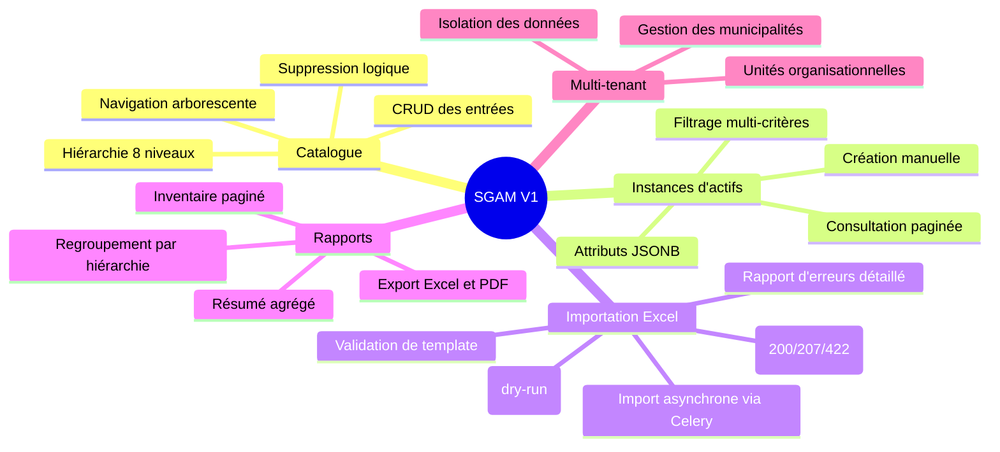

# Charte de Projet — Système de Gestion des Actifs Municipaux

## 1. Nom du Projet

**Système de Gestion des Actifs Municipaux (SGAM)**

---

## 2. Vision et Objectifs

### Vision

Fournir aux municipalités une plateforme centralisée, moderne et évolutive pour gérer l'ensemble de leurs actifs d'infrastructure (réseaux d'eau, stations de pompage, réservoirs, etc.) selon une taxonomie hiérarchique normalisée à 8 niveaux.

### Objectifs Stratégiques

| # | Objectif | Indicateur de succès |
|---|----------|---------------------|
| O1 | Centraliser l'inventaire des actifs municipaux | 100% des actifs enregistrés dans le système |
| O2 | Standardiser la classification des actifs | Adoption de la hiérarchie à 8 niveaux par toutes les municipalités |
| O3 | Réduire le temps de saisie des données | Importation Excel en masse fonctionnelle |
| O4 | Améliorer la visibilité sur l'état du patrimoine | Rapports filtrables et exportables disponibles |
| O5 | Supporter plusieurs municipalités | Isolation des données par tenant |

---

## 3. Portée

### V1 — Gestion de Base (Portée Actuelle)

### V2 — Sécurité et Multi-tenant Avancé (Futur)

- Authentification (JWT, sessions)
- Contrôle d'accès basé sur les rôles (RBAC)
- Journal d'audit complet
- Gestion des utilisateurs

### V3 — Cycle de Vie et Intelligence (Futur)

- Suivi des statuts et transitions
- Historique des modifications
- Planification de la maintenance
- Suivi des coûts
- Intégration GIS (géolocalisation)

---

## 4. Parties Prenantes

| Rôle | Description | Intérêt Principal |
|------|-------------|-------------------|
| **Opérateur municipal** | Utilisateur principal qui gère les actifs au quotidien | Saisie efficace, importation en masse, consultation rapide |
| **Administrateur système** | Responsable de la configuration et de la maintenance | Multi-tenant, intégrité des données, performance |
| **Gestionnaire public** | Décideur qui utilise les rapports pour la planification | Rapports clairs, exports pour présentations |
| **Analyste** | Spécialiste qui analyse les données d'inventaire | Filtrage avancé, données complètes, exports structurés |

---

## 5. Critères de Succès

| Critère | Mesure | Cible |
|---------|--------|-------|
| Performance API | Temps de réponse requête unique | < 500 ms |
| Performance API | Temps de réponse liste paginée | < 2000 ms |
| Import Excel | Traitement de 10 000 lignes | < 30 secondes |
| Disponibilité | Uptime du système | 99.5% |
| Qualité des données | Taux de validation réussie à l'import | > 95% |
| Adoption | Municipalités utilisant le système | ≥ 2 en V1 |

---

## 6. Contraintes et Hypothèses

### Contraintes

- **Technologiques** : Stack imposée — Python/FastAPI (backend), React/TypeScript (frontend), PostgreSQL 16 (base de données)
- **Linguistiques** : Terminologie du domaine en français dans le modèle de données
- **Compatibilité** : Support des navigateurs modernes (Chrome, Firefox, Edge, Safari)
- **Déploiement** : Conteneurisation Docker obligatoire
- **Sécurité V1** : Authentification minimale (reportée en V2 pour le RBAC complet)

### Hypothèses

- Les municipalités disposent de fichiers Excel existants pour l'importation initiale
- La hiérarchie à 8 niveaux est suffisante pour classifier tous les types d'actifs municipaux
- Les utilisateurs ont accès à un navigateur web moderne
- L'infrastructure de déploiement (serveur, réseau) est disponible
- Le catalogue hiérarchique est partagé entre toutes les municipalités

---

## 7. Budget et Calendrier

| Élément | Estimation |
|---------|-----------|
| Budget total | À déterminer (TBD) |
| Durée estimée V1 | À déterminer (TBD) |
| Équipe requise | À déterminer (TBD) |
| Date de début | À déterminer (TBD) |
| Date de livraison V1 | À déterminer (TBD) |

---

## 8. Risques Identifiés

| Risque | Probabilité | Impact | Mitigation |
|--------|-------------|--------|-----------|
| Qualité des données Excel existantes | Élevée | Moyen | Mode dry-run, rapport d'erreurs détaillé |
| Complexité de la hiérarchie à 8 niveaux | Moyenne | Élevé | Interface arborescente intuitive, validation stricte |
| Performance avec grands volumes | Moyenne | Élevé | Index partiels, pagination, traitement asynchrone |
| Adoption par les utilisateurs | Moyenne | Élevé | Interface simple, importation Excel familière |

---

## 9. Approbations

| Rôle | Nom | Date | Signature |
|------|-----|------|-----------|
| Sponsor du projet | _________________ | ________ | ________ |
| Chef de projet | _________________ | ________ | ________ |
| Architecte technique | _________________ | ________ | ________ |
| Représentant utilisateurs | _________________ | ________ | ________ |
