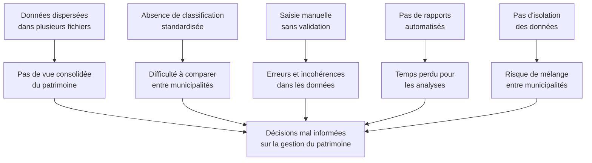

# Exigences d'Affaires — Système de Gestion des Actifs Municipaux

## 1. Contexte et Problématique

### Situation Actuelle

Les municipalités gèrent des milliers d'actifs d'infrastructure (réseaux d'eau potable, stations de pompage, réservoirs, conduites, vannes, etc.) à l'aide de fichiers Excel dispersés, de systèmes hétérogènes ou de processus manuels non standardisés.

### Problèmes Identifiés

### Besoin Fondamental

Les municipalités ont besoin d'un système centralisé de gestion des actifs qui :
- Organise les actifs selon une taxonomie hiérarchique normalisée
- Permette la saisie manuelle et l'importation en masse
- Fournisse des rapports filtrables et exportables
- Isole les données de chaque municipalité

---

## 2. Proposition de Valeur

| Pour | Le SGAM offre |
|------|---------------|
| **Opérateurs municipaux** | Un outil unique pour enregistrer, consulter et maintenir l'inventaire des actifs avec importation Excel |
| **Gestionnaires publics** | Des rapports clairs et exportables pour la planification et la communication |
| **Administrateurs** | Une plateforme multi-tenant sécurisée avec validation automatique des données |
| **Analystes** | Un accès structuré aux données avec filtrage avancé et exports |

### Bénéfices Attendus

1. **Gain de temps** : Importation en masse vs saisie unitaire
2. **Qualité des données** : Validation automatique à chaque entrée
3. **Standardisation** : Classification uniforme à 8 niveaux
4. **Visibilité** : Rapports instantanés sur l'état du patrimoine
5. **Scalabilité** : Support de plusieurs municipalités sur une même plateforme

---

## 3. Objectifs d'Affaires Mesurables

| # | Objectif | KPI | Cible V1 | Horizon |
|---|----------|-----|----------|---------|
| OA-1 | Centraliser 100% des actifs dans un système unique | % d'actifs enregistrés | 100% | 6 mois post-déploiement |
| OA-2 | Réduire le temps de saisie initiale | Temps moyen par lot de 1000 actifs | < 5 min (import Excel) | Immédiat |
| OA-3 | Améliorer la qualité des données | Taux d'erreurs à l'import | < 5% après correction | 3 mois |
| OA-4 | Accélérer la production de rapports | Temps pour générer un rapport d'inventaire | < 10 secondes | Immédiat |
| OA-5 | Supporter le multi-municipal | Nombre de municipalités actives | ≥ 2 | V1 |

---

## 4. Personas Utilisateurs

### Persona 1 : Opérateur Municipal

| Attribut | Détail |
|----------|--------|
| **Profil** | Technicienne en travaux publics |
| **Compétences techniques** | Maîtrise Excel, utilisation basique du web |
| **Fréquence d'utilisation** | Quotidienne à hebdomadaire |
| **Tâches principales** | Créer des actifs, importer des fichiers Excel, consulter l'inventaire |
| **Critères de satisfaction** | Interface simple, importation rapide, messages d'erreur clairs |

### Persona 2 : Administrateur Système

| Attribut | Détail |
|----------|--------|
| **Profil** | Responsable informatique municipal |
| **Compétences techniques** | Administration système, bases de données |
| **Fréquence d'utilisation** | Hebdomadaire |
| **Tâches principales** | Gérer les municipalités (tenants), configurer le catalogue, surveiller les imports |
| **Critères de satisfaction** | Intégrité des données, isolation des tenants, outils d'administration |

### Persona 3 : Gestionnaire Public

| Attribut | Détail |
|----------|--------|
| **Profil** | Directeur des travaux publics ou élu municipal |
| **Compétences techniques** | Utilisateur bureautique (Excel, PDF) |
| **Fréquence d'utilisation** | Mensuelle à trimestrielle |
| **Tâches principales** | Consulter les rapports, exporter pour présentations, analyser les tendances |
| **Critères de satisfaction** | Rapports clairs, exports PDF/Excel professionnels, données fiables |

### Persona 4 : Analyste

| Attribut | Détail |
|----------|--------|
| **Profil** | Analyste en gestion d'actifs |
| **Compétences techniques** | Analyse de données, requêtes avancées |
| **Fréquence d'utilisation** | Hebdomadaire |
| **Tâches principales** | Filtrer les données, croiser les informations, produire des analyses |
| **Critères de satisfaction** | Filtrage multi-critères, données complètes, exports structurés |

---

## 5. Besoins d'Affaires de Haut Niveau

### BA-01 : Gestion du Catalogue Hiérarchique

> Le système doit permettre de gérer une taxonomie d'actifs à 8 niveaux (Service → Fonction → Sous-fonction → Type d'actif → Actif primaire → Discipline → Actif secondaire → Actif tertiaire) partagée entre toutes les municipalités.

**Priorité** : Critique  
**Justification** : Fondation de toute la classification des actifs

### BA-02 : Gestion des Instances d'Actifs

> Le système doit permettre de créer, consulter, modifier et désactiver des instances physiques d'actifs rattachées à une municipalité et à un niveau du catalogue.

**Priorité** : Critique  
**Justification** : Fonction principale du système — l'inventaire

### BA-03 : Importation en Masse via Excel

> Le système doit permettre d'importer des milliers d'actifs depuis des fichiers Excel avec validation automatique, rapport d'erreurs détaillé et mode simulation.

**Priorité** : Élevée  
**Justification** : Migration des données existantes et saisie efficace

### BA-04 : Rapports et Exportation

> Le système doit fournir des rapports d'inventaire filtrables, regroupables par niveau hiérarchique, et exportables en Excel et PDF.

**Priorité** : Élevée  
**Justification** : Visibilité sur le patrimoine et communication aux parties prenantes

### BA-05 : Support Multi-Tenant

> Le système doit supporter plusieurs municipalités avec isolation complète des données d'instances tout en partageant le catalogue hiérarchique.

**Priorité** : Élevée  
**Justification** : Scalabilité et réutilisation de la plateforme

### BA-06 : Validation et Intégrité des Données

> Le système doit valider toutes les entrées (API et import) selon des règles strictes et fournir des messages d'erreur détaillés au niveau des champs.

**Priorité** : Élevée  
**Justification** : Qualité des données et confiance des utilisateurs

---

## 6. Matrice de Traçabilité

| Besoin d'Affaires | Personas Concernés | Objectif d'Affaires |
|-------------------|-------------------|---------------------|
| BA-01 Catalogue | Administrateur, Opérateur | OA-1, OA-3 |
| BA-02 Instances | Opérateur, Analyste | OA-1, OA-4 |
| BA-03 Import Excel | Opérateur | OA-2, OA-3 |
| BA-04 Rapports | Gestionnaire, Analyste | OA-4 |
| BA-05 Multi-tenant | Administrateur | OA-5 |
| BA-06 Validation | Tous | OA-3 |
