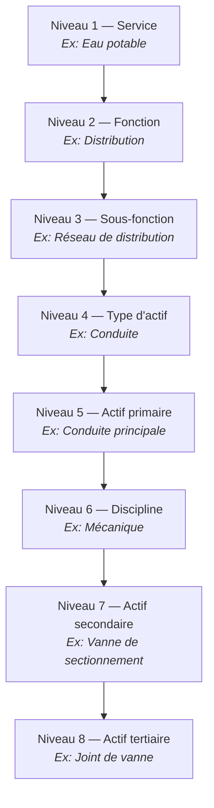
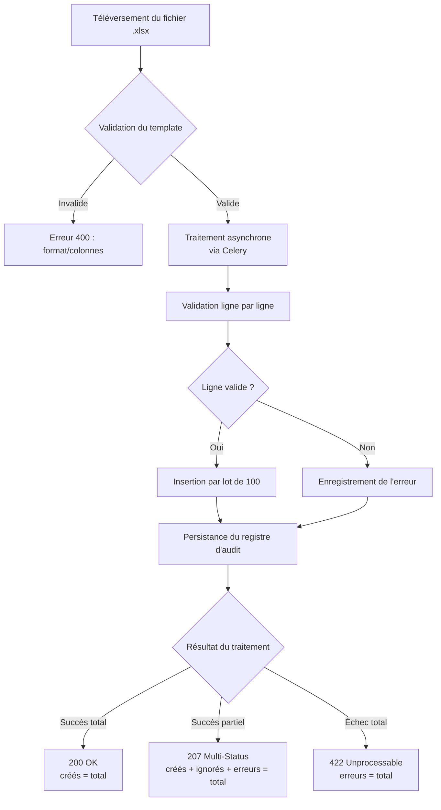
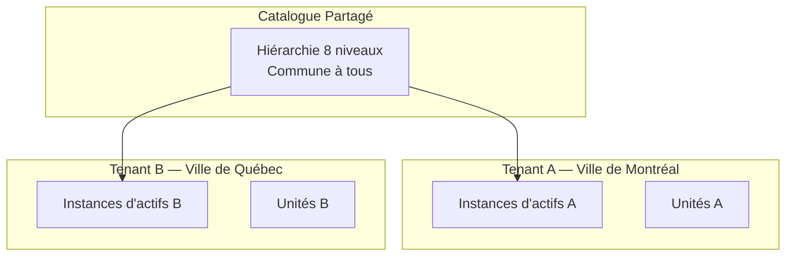

# Exigences Fonctionnelles — Système de Gestion des Actifs Municipaux

## 1. Gestion du Catalogue Hiérarchique (8 Niveaux)

### Description

Le système maintient une taxonomie d'actifs organisée en 8 niveaux hiérarchiques stricts. Ce catalogue est partagé entre toutes les municipalités et sert de référence pour classifier les instances d'actifs.

### Structure Hiérarchique

### Exigences Détaillées

| # | Exigence | Priorité |
|---|----------|----------|
| EF-CAT-01 | Le système doit maintenir la structure hiérarchique à 8 niveaux | Critique |
| EF-CAT-02 | L'utilisateur peut consulter l'arborescence complète ou filtrée par service | Critique |
| EF-CAT-03 | Seules les entrées actives (sans date de fin) sont affichées par défaut | Critique |
| EF-CAT-04 | La création d'une entrée de niveau 2+ exige un parent actif valide | Élevée |
| EF-CAT-05 | Chaque code doit être unique au sein de son niveau hiérarchique | Élevée |
| EF-CAT-06 | Les codes doivent respecter le format : majuscules alphanumériques + underscore, 1 à 50 caractères | Élevée |
| EF-CAT-07 | Les codes sont immuables après création | Élevée |
| EF-CAT-08 | La désactivation d'une entrée ayant des enfants actifs est interdite | Élevée |
| EF-CAT-09 | La désactivation positionne une date de fin (suppression logique) | Élevée |
| EF-CAT-10 | Les erreurs de validation retournent des détails au niveau du champ | Moyenne |

---

## 2. Gestion des Instances d'Actifs

### Description

Les instances d'actifs représentent les équipements physiques concrets appartenant à une municipalité. Chaque instance est rattachée à exactement un niveau du catalogue (primaire, secondaire ou tertiaire).

### Exigences Détaillées

| # | Exigence | Priorité |
|---|----------|----------|
| EF-INST-01 | Chaque instance doit référencer exactement un niveau du catalogue (primaire XOR secondaire XOR tertiaire) | Critique |
| EF-INST-02 | La référence catalogue doit pointer vers une entrée active | Critique |
| EF-INST-03 | Le code d'instance doit être unique au sein de la municipalité | Critique |
| EF-INST-04 | Le code d'instance accepte : alphanumériques + underscore + tiret, 1 à 50 caractères | Élevée |
| EF-INST-05 | Chaque instance doit être associée à une municipalité active | Critique |
| EF-INST-06 | La consultation retourne des résultats paginés (1 à 500 éléments par page) | Élevée |
| EF-INST-07 | Le filtrage est possible par niveaux hiérarchiques, municipalité, unité et attributs | Élevée |
| EF-INST-08 | La modification respecte les mêmes règles que la création (code immuable) | Élevée |
| EF-INST-09 | La désactivation positionne une date de fin (suppression logique) | Élevée |
| EF-INST-10 | Les attributs spécifiques sont stockés en JSONB (max 10 Ko par instance) | Moyenne |

---

## 3. Importation Excel en Masse

### Description

Le système permet d'importer des milliers d'actifs depuis des fichiers Excel (.xlsx) avec validation complète, gestion des erreurs et mode simulation.

### Flux d'Importation

### Exigences Détaillées

| # | Exigence | Priorité |
|---|----------|----------|
| EF-IMP-01 | Accepter uniquement les fichiers .xlsx de 50 Mo maximum et 50 000 lignes maximum | Critique |
| EF-IMP-02 | Valider la présence d'une feuille « Actifs » avec les colonnes requises | Critique |
| EF-IMP-03 | Valider chaque ligne en résolvant les codes hiérarchiques vers des entrées actives | Critique |
| EF-IMP-04 | Les lignes invalides sont ignorées avec enregistrement détaillé de l'erreur | Élevée |
| EF-IMP-05 | Les doublons de code instance (même tenant) sont ignorés si l'option est activée | Élevée |
| EF-IMP-06 | Le résultat respecte l'identité : créés + ignorés + erreurs = total des lignes | Critique |
| EF-IMP-07 | Le mode simulation (dry-run) valide sans persister | Élevée |
| EF-IMP-08 | Tous les imports sont traités de manière asynchrone via Celery. Le client reçoit la réponse uniquement à la fin du traitement complet du fichier. | Élevée |
| EF-IMP-09 | L'insertion se fait par lots de 100 avec rollback par lot en cas d'erreur | Élevée |
| EF-IMP-10 | Un registre d'audit est persisté pour chaque import (nom, hash SHA-256, compteurs, horodatages) | Élevée |
| EF-IMP-11 | La chaîne hiérarchique complète est vérifiée (cohérence parent-enfant à chaque niveau) | Élevée |
| EF-IMP-12 | Le code HTTP de retour dépend du résultat : 200 si toutes les lignes sont importées avec succès, 207 (Multi-Status) si certaines lignes ont échoué ou été ignorées, 422 si aucune ligne n'a pu être importée | Élevée |

### Colonnes Requises du Template

| Colonne | Obligatoire | Description |
|---------|-------------|-------------|
| `instance_code` | Oui | Code unique de l'instance |
| `instance_nom` | Oui | Nom de l'instance |
| `serv_code` | Oui | Code du service |
| `fonc_code` | Oui | Code de la fonction |
| `sous_fonc_code` | Oui | Code de la sous-fonction |
| `type_actif_code` | Oui | Code du type d'actif |
| `prim_code` | Conditionnel | Code de l'actif primaire (au moins un des trois) |
| `seco_code` | Conditionnel | Code de l'actif secondaire |
| `tert_code` | Conditionnel | Code de l'actif tertiaire |

---

## 4. Rapports et Exportation

### Description

Le système fournit des rapports d'inventaire avec filtrage multi-critères, regroupement par niveau hiérarchique, et exportation en formats Excel et PDF.

### Types de Rapports

| Type | Description | Sortie |
|------|-------------|--------|
| Inventaire | Liste paginée des instances avec filtres | Tableau paginé |
| Par hiérarchie | Actifs regroupés par niveau (code, nom, nombre) | Groupes avec compteurs |
| Résumé | Compteurs agrégés par hiérarchie et tenant | Tableau de synthèse |

### Exigences Détaillées

| # | Exigence | Priorité |
|---|----------|----------|
| EF-RAP-01 | Rapport d'inventaire paginé avec total, page courante, taille et nombre de pages | Critique |
| EF-RAP-02 | Tous les filtres s'appliquent en logique ET (AND) | Élevée |
| EF-RAP-03 | Regroupement par n'importe quel niveau hiérarchique avec compteur par groupe | Élevée |
| EF-RAP-04 | Rapport résumé avec compteurs par hiérarchie et par tenant | Élevée |
| EF-RAP-05 | Filtrage par : service, fonction, sous-fonction, type, tenant, unité, discipline, plage de dates, recherche textuelle | Élevée |
| EF-RAP-06 | Pagination configurable de 1 à 500 éléments (défaut : 25) | Élevée |
| EF-RAP-07 | Tri par toute colonne du rapport (ascendant/descendant, défaut : code instance ASC) | Moyenne |
| EF-RAP-08 | Tri déterministe avec briseur d'égalité (instance_id) | Moyenne |
| EF-RAP-09 | Un filtre référençant un code inexistant retourne un résultat vide (pas d'erreur) | Moyenne |

### Exportation

| # | Exigence | Priorité |
|---|----------|----------|
| EF-EXP-01 | Export Excel (.xlsx) avec en-têtes et toutes les lignes filtrées (hors pagination) | Élevée |
| EF-EXP-02 | Export PDF avec titre, en-têtes, données tabulaires et numéros de page | Élevée |
| EF-EXP-03 | L'export applique les mêmes filtres que l'affichage à l'écran | Élevée |
| EF-EXP-04 | Les exports > 1000 lignes sont traités de manière asynchrone | Moyenne |
| EF-EXP-05 | En cas d'erreur, aucun fichier partiel ou corrompu n'est produit | Moyenne |

---

## 5. Support Multi-Tenant

### Description

Le système supporte plusieurs municipalités (tenants) avec isolation complète des données d'instances. Le catalogue hiérarchique est partagé, mais les instances d'actifs sont propres à chaque municipalité.

### Exigences Détaillées

| # | Exigence | Priorité |
|---|----------|----------|
| EF-MT-01 | Chaque instance d'actif est associée à exactement une municipalité | Critique |
| EF-MT-02 | Les requêtes retournent uniquement les instances du tenant spécifié | Critique |
| EF-MT-03 | L'unicité du code instance est limitée au périmètre du tenant | Élevée |
| EF-MT-04 | Le code tenant est unique globalement (format : majuscules + underscore, 1-50 car.) | Élevée |
| EF-MT-05 | Chaque tenant peut avoir des unités organisationnelles (code unique global) | Moyenne |
| EF-MT-06 | L'import associe toutes les instances créées au tenant spécifié | Élevée |
| EF-MT-07 | La création d'un tenant avec un code existant est rejetée | Élevée |
| EF-MT-08 | Un tenant inactif (date de fin positionnée) ne peut pas recevoir de nouvelles instances | Élevée |

---

## 6. Validation des Données

### Description

Le système valide toutes les entrées de données (API et import) selon des règles strictes et retourne des messages d'erreur détaillés identifiant chaque champ invalide.

### Règles de Validation

| Règle | Champs Concernés | Format/Contrainte |
|-------|-----------------|-------------------|
| Format code catalogue | Tous les `*_code` | `^[A-Z0-9_]{1,50}$` |
| Format code instance | `instance_code` | `^[A-Za-z0-9_\-]{1,50}$` |
| Nom non vide | Tous les `*_nom` | 1-255 caractères, pas uniquement des espaces |
| Référence XOR | `prim_code`, `seco_code`, `tert_code` | Exactement un non-null |
| Référence active | Toutes les FK catalogue | L'entrée référencée doit avoir `end_date IS NULL` |
| Numéro de série | `serial_number` | Max 120 caractères |
| Date d'installation | `installation_date` | Format ISO 8601 (AAAA-MM-JJ) |
| Unité valide | `tenant_unite_id` | Doit appartenir au `tenant_ville_id` spécifié |

### Comportement de Validation

| # | Exigence | Priorité |
|---|----------|----------|
| EF-VAL-01 | Toutes les erreurs d'un même requête sont retournées (pas d'arrêt à la première) | Élevée |
| EF-VAL-02 | Chaque erreur contient : nom du champ, valeur rejetée, message descriptif | Élevée |
| EF-VAL-03 | La validation est déterministe (même entrée = même résultat) | Élevée |
| EF-VAL-04 | Les champs optionnels sont validés uniquement s'ils sont fournis | Moyenne |

---

## 7. Suppression Logique (Soft Delete)

### Description

Aucun enregistrement n'est physiquement supprimé. La désactivation positionne une date de fin (`end_date`) qui exclut l'enregistrement des résultats de requête tout en préservant l'historique.

### Exigences Détaillées

| # | Exigence | Priorité |
|---|----------|----------|
| EF-SD-01 | La suppression positionne `end_date` au timestamp courant | Critique |
| EF-SD-02 | Les enregistrements avec `end_date` non-null sont exclus de toutes les requêtes utilisateur | Critique |
| EF-SD-03 | Les enregistrements supprimés sont conservés indéfiniment | Élevée |
| EF-SD-04 | Impossible de créer un enfant sous un parent inactif | Élevée |
| EF-SD-05 | La restauration remet `end_date` à NULL | Moyenne |
| EF-SD-06 | La restauration est bloquée si le parent est inactif | Moyenne |
| EF-SD-07 | La désactivation d'un parent n'affecte pas les enfants actifs existants | Moyenne |
