# Modèle de Données — Système de Gestion des Actifs Municipaux

## 1. Vue d'Ensemble

Le modèle de données comprend **13 tables** organisées en 4 groupes fonctionnels :

| Groupe | Tables | Rôle |
|--------|--------|------|
| Catalogue hiérarchique | 9 tables | Taxonomie des actifs à 8 niveaux |
| Tenant / Opérationnel | 2 tables | Isolation des municipalités et unités |
| Instances | 1 table | Actifs physiques concrets |
| Audit | 1 table | Historique des importations |

---

## 2. Diagramme Entité-Relation

```mermaid
erDiagram
    actif_famille {
        varchar(50) fami_code PK
        varchar(255) fami_nom
        varchar(500) fami_description
        boolean is_active
        timestamp created_at
        timestamp end_date
    }

    actif_service {
        varchar(50) serv_code PK
        varchar(255) serv_nom
        varchar(50) fami_code FK
        boolean is_active
        timestamp created_at
        timestamp end_date
    }

    actif_fonction {
        varchar(50) fonc_code PK
        varchar(255) fonc_nom
        varchar(50) serv_code FK
        boolean is_active
        timestamp created_at
        timestamp end_date
    }

    sous_fonction {
        varchar(50) sous_fonc_code PK
        varchar(255) sous_fonc_nom
        varchar(50) fonc_code FK
        boolean is_active
        timestamp created_at
        timestamp end_date
    }

    type_actif {
        varchar(50) type_actif_code PK
        varchar(255) type_actif_nom
        varchar(50) sous_fonc_code FK
        boolean is_active
        timestamp created_at
        timestamp end_date
    }

    actif_discipline {
        varchar(50) disc_code PK
        varchar(255) disc_nom
    }

    actif_primaire {
        varchar(50) prim_code PK
        varchar(255) prim_nom
        varchar(50) type_actif_code FK
        varchar(50) fonc_code
        varchar(50) serv_code
        boolean is_active
        timestamp created_at
        timestamp end_date
    }

    actif_secondaire {
        varchar(50) seco_code PK
        varchar(255) seco_nom
        varchar(50) prim_code FK
        varchar(50) disc_code FK
        boolean is_active
        timestamp created_at
        timestamp end_date
    }

    actif_tertiaire {
        varchar(50) tert_code PK
        varchar(255) tert_nom
        varchar(50) seco_code FK
        boolean is_active
        timestamp created_at
        timestamp end_date
    }

    tenant_ville {
        int tenant_ville_id PK
        varchar(50) tenant_code UK
        varchar(255) tenant_nom
        boolean is_active
        timestamp created_at
        timestamp updated_at
        timestamp end_date
    }

    tenant_unite {
        int tenant_unite_id PK
        int tenant_ville_id FK
        varchar(50) unite_code UK
        varchar(255) unite_nom
        varchar(255) unite_location
        varchar(50) categorie_code
        boolean is_active
        timestamp created_at
        timestamp updated_at
        timestamp end_date
    }

    actif_instance {
        int instance_id PK
        varchar(50) instance_code
        varchar(255) instance_nom
        varchar(50) prim_code FK "nullable - XOR"
        varchar(50) seco_code FK "nullable - XOR"
        varchar(50) tert_code FK "nullable - XOR"
        int tenant_ville_id FK
        int tenant_unite_id FK "nullable"
        date installation_date "nullable"
        varchar(120) serial_number "nullable"
        jsonb attributes "nullable"
        varchar(50) status_code "default ACTIF"
        text notes "nullable"
        timestamp created_at
        timestamp updated_at
        timestamp end_date "nullable"
    }

    import_record {
        int import_id PK
        int tenant_ville_id FK
        varchar(255) filename
        varchar(64) file_hash
        int total_rows
        int created_count
        int skipped_count
        int error_count
        jsonb errors_json "nullable"
        varchar(20) status
        varchar(100) imported_by
        timestamp started_at
        timestamp completed_at "nullable"
    }

    %% Relations du catalogue hiérarchique
    actif_famille ||--o{ actif_service : "contient"
    actif_service ||--o{ actif_fonction : "contient"
    actif_fonction ||--o{ sous_fonction : "contient"
    sous_fonction ||--o{ type_actif : "contient"
    type_actif ||--o{ actif_primaire : "contient"
    actif_primaire ||--o{ actif_secondaire : "contient"
    actif_discipline ||--o{ actif_secondaire : "classifie"
    actif_secondaire ||--o{ actif_tertiaire : "contient"

    %% Relations des tenants
    tenant_ville ||--o{ tenant_unite : "contient"

    %% Relations des instances
    actif_primaire ||--o{ actif_instance : "instancié en"
    actif_secondaire ||--o{ actif_instance : "instancié en"
    actif_tertiaire ||--o{ actif_instance : "instancié en"
    tenant_ville ||--o{ actif_instance : "possède"
    tenant_unite ||--o{ actif_instance : "localisé dans"

    %% Relations d'audit
    tenant_ville ||--o{ import_record : "importe pour"
```

---

## 3. Description des Groupes de Tables

### 3.1 Catalogue Hiérarchique (9 tables)

Ce groupe représente la **taxonomie de référence** des actifs municipaux. Il s'agit d'un arbre à 8 niveaux où chaque entrée est identifiée par un code unique et rattachée à son parent.

| Table | Niveau | Rôle | Exemple |
|-------|--------|------|---------|
| `actif_famille` | 0 (racine) | Famille d'actifs (regroupement de services) | Infrastructure |
| `actif_service` | 1 | Service municipal | Eau potable (EP) |
| `actif_fonction` | 2 | Fonction au sein du service | Distribution (DIST) |
| `sous_fonction` | 3 | Sous-fonction spécifique | Réseau de distribution |
| `type_actif` | 4 | Type d'actif | Conduite |
| `actif_primaire` | 5 | Actif primaire (équipement principal) | Conduite principale |
| `actif_discipline` | 6 | Discipline technique (classification transversale) | Mécanique, Électrique |
| `actif_secondaire` | 7 | Actif secondaire (composant) | Vanne de sectionnement |
| `actif_tertiaire` | 8 | Actif tertiaire (sous-composant) | Joint de vanne |

**Caractéristiques communes :**
- Chaque table possède un code primaire (`*_code`) servant de clé primaire
- Un nom descriptif (`*_nom`)
- Un indicateur d'activité (`is_active`)
- Un horodatage de création (`created_at`)
- Une date de fin pour la suppression logique (`end_date`)

### 3.2 Tenant / Opérationnel (2 tables)

Ce groupe gère l'**isolation des données par municipalité**.

| Table | Rôle | Description |
|-------|------|-------------|
| `tenant_ville` | Municipalité | Représente une ville/municipalité. Chaque instance d'actif appartient à exactement un tenant. |
| `tenant_unite` | Unité organisationnelle | Subdivision optionnelle d'une municipalité (installation, district, site). |

**Points clés :**
- `tenant_code` est unique globalement (ex: « MTL » pour Montréal)
- `unite_code` est unique globalement
- Un tenant inactif ne peut plus recevoir de nouvelles instances
- Les unités sont optionnelles et rattachées à une ville

### 3.3 Instances d'Actifs (1 table)

La table `actif_instance` contient les **actifs physiques concrets** — les équipements réels sur le terrain.

| Champ | Description |
|-------|-------------|
| `instance_id` | Identifiant auto-incrémenté |
| `instance_code` | Code unique au sein du tenant (ex: « POMPE-001 ») |
| `instance_nom` | Nom descriptif de l'actif |
| `prim_code` / `seco_code` / `tert_code` | Référence au catalogue (exactement un non-null) |
| `tenant_ville_id` | Municipalité propriétaire |
| `tenant_unite_id` | Unité organisationnelle (optionnel) |
| `installation_date` | Date d'installation (optionnel) |
| `serial_number` | Numéro de série (optionnel, max 120 car.) |
| `attributes` | Attributs spécifiques en JSONB (max 10 Ko) |
| `status_code` | Statut de l'actif (défaut : ACTIF) |
| `notes` | Notes libres |
| `end_date` | Date de désactivation (suppression logique) |

### 3.4 Audit (1 table)

La table `import_record` conserve l'**historique de toutes les importations Excel**.

| Champ | Description |
|-------|-------------|
| `import_id` | Identifiant de l'import |
| `tenant_ville_id` | Municipalité concernée |
| `filename` | Nom du fichier importé |
| `file_hash` | Hash SHA-256 du fichier (détection de doublons) |
| `total_rows` | Nombre total de lignes traitées |
| `created_count` | Nombre d'instances créées |
| `skipped_count` | Nombre de lignes ignorées |
| `error_count` | Nombre d'erreurs |
| `errors_json` | Détail des erreurs en JSON |
| `status` | Statut : completed, partial, failed |
| `imported_by` | Utilisateur ayant lancé l'import |
| `started_at` / `completed_at` | Horodatages de début et fin |

---

## 4. Contraintes Clés

| Contrainte | Table | Règle |
|-----------|-------|-------|
| Référence XOR | `actif_instance` | Exactement un de `prim_code`, `seco_code`, `tert_code` est non-null |
| Code unique par tenant | `actif_instance` | `UNIQUE(instance_code, tenant_ville_id)` |
| Codes uniques | Toutes les tables catalogue | Chaque `*_code` est la clé primaire (unique par définition) |
| Suppression logique | Toutes les tables | `end_date IS NULL` = actif ; les requêtes filtrent par défaut |
| Chaîne hiérarchique | Contraintes FK | tertiaire → secondaire → primaire → type_actif → sous_fonction → fonction → service → famille |
| Code tenant unique | `tenant_ville` | `tenant_code` unique globalement |
| Code unité unique | `tenant_unite` | `unite_code` unique globalement |

---

## 5. Index de Performance

| Index | Table | Objectif |
|-------|-------|----------|
| `idx_actif_fonction_service` | `actif_fonction` | Traversée hiérarchique (enregistrements actifs uniquement) |
| `idx_sous_fonction_fonction` | `sous_fonction` | Traversée hiérarchique |
| `idx_type_actif_sous_fonc` | `type_actif` | Traversée hiérarchique |
| `idx_actif_primaire_type` | `actif_primaire` | Traversée hiérarchique |
| `idx_actif_secondaire_prim` | `actif_secondaire` | Traversée hiérarchique |
| `idx_actif_tertiaire_seco` | `actif_tertiaire` | Traversée hiérarchique |
| `idx_instance_tenant` | `actif_instance` | Requêtes par municipalité |
| `idx_instance_prim` | `actif_instance` | Requêtes par actif primaire |
| `idx_instance_seco` | `actif_instance` | Requêtes par actif secondaire |
| `idx_instance_tert` | `actif_instance` | Requêtes par actif tertiaire |
| `idx_instance_code_tenant` | `actif_instance` | Vérification d'unicité |
| `idx_instance_nom_trgm` | `actif_instance` | Recherche plein texte (trigrammes) |

> **Note** : Tous les index de traversée hiérarchique sont des **index partiels** (`WHERE end_date IS NULL`) pour optimiser les requêtes sur les enregistrements actifs uniquement.

---

## 6. Règles de Validation

| Règle | Champs | Format |
|-------|--------|--------|
| Format code catalogue | Tous les `*_code` (catalogue) | `^[A-Z0-9_]{1,50}$` — majuscules, chiffres, underscore |
| Format code instance | `instance_code` | `^[A-Za-z0-9_\-]{1,50}$` — alphanumérique, underscore, tiret |
| Nom non vide | Tous les `*_nom` | Non vide, non uniquement espaces, max 255 caractères |
| Référence active | Toutes les clés étrangères | L'enregistrement parent doit avoir `end_date IS NULL` |
| Codes immuables | Tous les `*_code` | Impossible de modifier après création |
| Taille JSONB | `attributes` | Maximum 10 Ko par instance |
| Numéro de série | `serial_number` | Maximum 120 caractères |
| Date d'installation | `installation_date` | Format ISO 8601 valide (AAAA-MM-JJ) |
