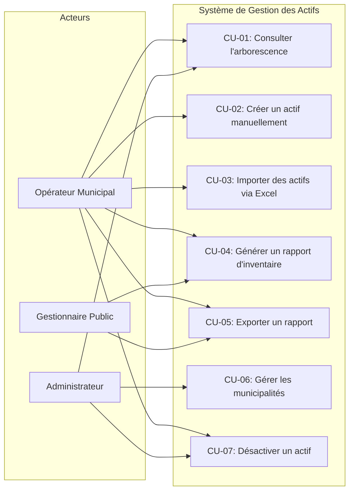
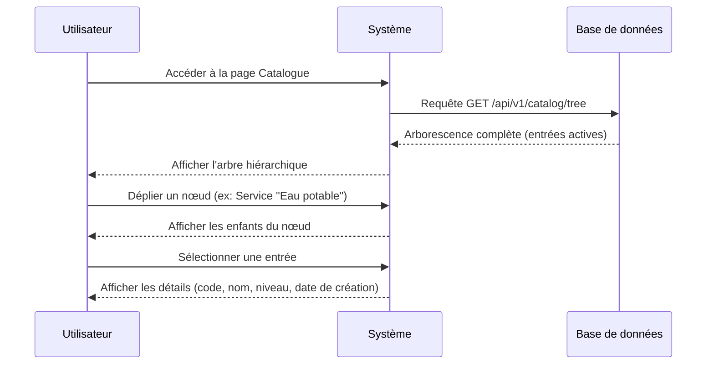
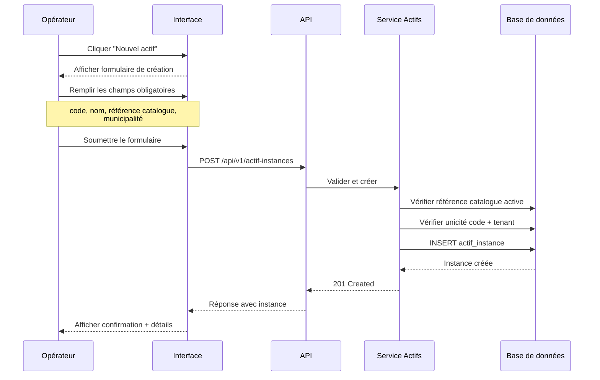
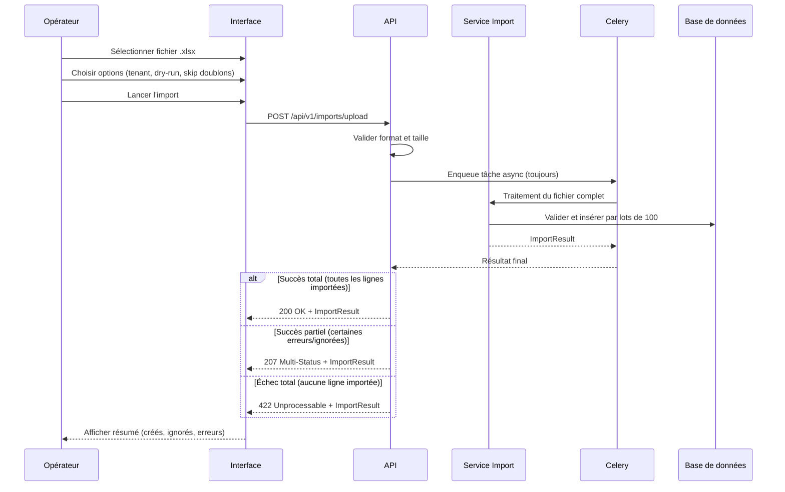

# Cas d'Utilisation — Système de Gestion des Actifs Municipaux

## Diagramme des Cas d'Utilisation

---

## CU-01 : Consulter l'Arborescence des Actifs

### Informations Générales

| Élément | Détail |
|---------|--------|
| **Identifiant** | CU-01 |
| **Nom** | Consulter l'arborescence des actifs |
| **Acteur principal** | Opérateur municipal |
| **Acteurs secondaires** | Administrateur, Analyste |
| **Description** | L'utilisateur consulte la hiérarchie complète du catalogue d'actifs sous forme d'arborescence navigable |

### Préconditions

- L'utilisateur est connecté au système
- Le catalogue contient au moins une entrée de service

### Flux Principal

1. L'utilisateur accède à la page « Catalogue »
2. Le système charge l'arborescence complète des entrées actives
3. L'arbre s'affiche avec les niveaux repliés par défaut
4. L'utilisateur déplie les nœuds pour naviguer dans la hiérarchie
5. L'utilisateur sélectionne une entrée pour voir ses détails

### Flux Alternatifs

| # | Condition | Action |
|---|-----------|--------|
| FA-1 | L'utilisateur filtre par service | Le système affiche uniquement le sous-arbre du service sélectionné |
| FA-2 | Le service filtré n'existe pas ou est inactif | Le système affiche un arbre vide |
| FA-3 | Le catalogue est vide | Le système affiche un message « Aucune entrée dans le catalogue » |

### Postconditions

- L'arborescence affichée ne contient que des entrées actives (`end_date IS NULL`)
- Chaque nœud affiche son code, nom, niveau et nombre d'enfants

### Règles Métier

- RM-01 : Seules les entrées actives sont affichées
- RM-02 : La profondeur maximale de l'arbre est de 8 niveaux
- RM-03 : Le filtrage par service retourne uniquement le sous-arbre correspondant

---

## CU-02 : Créer un Actif Manuellement

### Informations Générales

| Élément | Détail |
|---------|--------|
| **Identifiant** | CU-02 |
| **Nom** | Créer un actif manuellement |
| **Acteur principal** | Opérateur municipal |
| **Description** | L'opérateur crée une nouvelle instance d'actif physique en remplissant un formulaire |

### Préconditions

- L'utilisateur est connecté au système
- Au moins une municipalité (tenant) active existe
- Le catalogue contient des entrées aux niveaux primaire, secondaire ou tertiaire

### Flux Principal

1. L'opérateur clique sur « Nouvel actif »
2. Le système affiche le formulaire de création
3. L'opérateur saisit :
   - Code d'instance (obligatoire)
   - Nom de l'instance (obligatoire)
   - Référence catalogue : sélection d'un actif primaire, secondaire OU tertiaire
   - Municipalité (obligatoire)
   - Unité organisationnelle (optionnel)
   - Date d'installation (optionnel)
   - Numéro de série (optionnel)
   - Attributs spécifiques (optionnel)
   - Notes (optionnel)
4. L'opérateur soumet le formulaire
5. Le système valide toutes les données
6. Le système crée l'instance et affiche la confirmation

### Flux Alternatifs

| # | Condition | Action |
|---|-----------|--------|
| FA-1 | Code d'instance déjà existant pour ce tenant | Erreur 400 : « Code déjà utilisé dans cette municipalité » |
| FA-2 | Référence catalogue inactive | Erreur 400 : « L'entrée catalogue référencée est inactive » |
| FA-3 | Aucune référence catalogue sélectionnée | Erreur 400 : « Exactement une référence catalogue requise » |
| FA-4 | Plusieurs références catalogue sélectionnées | Erreur 400 : « Exactement une référence catalogue requise (XOR) » |
| FA-5 | Municipalité inactive | Erreur 400 : « La municipalité est inactive » |
| FA-6 | Format de code invalide | Erreur 400 : « Le code doit contenir uniquement des caractères alphanumériques, underscores et tirets » |

### Postconditions

- Une nouvelle instance d'actif est créée dans la base de données
- L'instance est associée à la municipalité spécifiée
- L'instance référence exactement un niveau du catalogue
- Le `status_code` est initialisé à « ACTIF »

### Règles Métier

- RM-04 : Exactement une référence catalogue (primaire XOR secondaire XOR tertiaire)
- RM-05 : Code instance unique par municipalité
- RM-06 : La municipalité doit être active
- RM-07 : La référence catalogue doit être active
- RM-08 : Le code est immuable après création
- RM-09 : Les attributs JSONB ne doivent pas dépasser 10 Ko

---

## CU-03 : Importer des Actifs via Excel

### Informations Générales

| Élément | Détail |
|---------|--------|
| **Identifiant** | CU-03 |
| **Nom** | Importer des actifs via Excel |
| **Acteur principal** | Opérateur municipal |
| **Description** | L'opérateur importe un lot d'actifs depuis un fichier Excel (.xlsx) avec validation et rapport d'erreurs |

### Préconditions

- L'utilisateur est connecté au système
- L'utilisateur dispose d'un fichier .xlsx conforme au template
- Une municipalité active est sélectionnée

### Flux Principal

1. L'opérateur sélectionne un fichier .xlsx
2. L'opérateur configure les options d'import :
   - Municipalité cible
   - Mode simulation (dry-run) : oui/non
   - Ignorer les doublons : oui/non
3. L'opérateur lance l'import
4. Le système valide le template (format, colonnes, taille)
5. Le système traite le fichier de manière asynchrone via Celery
6. Le système traite chaque ligne :
   - Validation des codes hiérarchiques
   - Vérification de la cohérence de la chaîne
   - Insertion par lots de 100
7. Le système retourne la réponse à la fin du traitement complet
8. Le code HTTP dépend du résultat (200, 207 ou 422)

### Flux Alternatifs

| # | Condition | Action |
|---|-----------|--------|
| FA-1 | Fichier non .xlsx | Erreur 400 : « INVALID_TEMPLATE — Format de fichier invalide » |
| FA-2 | Fichier > 50 Mo | Erreur 413 : « Taille maximale dépassée » |
| FA-3 | Colonnes requises manquantes | Erreur 400 : liste des colonnes manquantes |
| FA-4 | Plus de 50 000 lignes | Erreur 400 : « Nombre maximum de lignes dépassé » |
| FA-5 | Mode dry-run activé | Validation complète sans persistance |
| FA-6 | Erreur de lot (batch) | Rollback du lot, enregistrement des erreurs, poursuite |
| FA-7 | Plus de 1000 erreurs | Poursuite du traitement mais arrêt de l'enregistrement des erreurs (indicateur de troncature) |
| FA-8 | Toutes les lignes importées | Retour 200 OK |
| FA-9 | Import partiel (certaines erreurs) | Retour 207 Multi-Status |
| FA-10 | Aucune ligne importée | Retour 422 Unprocessable Entity |

### Postconditions

- Les instances valides sont créées dans la base de données
- Un registre d'audit est persisté (même en mode dry-run)
- L'identité comptable est respectée : créés + ignorés + erreurs = total
- Le code HTTP reflète le résultat du traitement
- En mode dry-run : aucune modification en base

### Règles Métier

- RM-10 : Identité comptable : créés + ignorés + erreurs = total des lignes
- RM-11 : Cohérence de la chaîne hiérarchique vérifiée à chaque niveau
- RM-12 : Insertion par lots de 100 avec rollback par lot
- RM-13 : Maximum 1000 erreurs enregistrées (troncature au-delà)
- RM-14 : Traitement toujours asynchrone via Celery, réponse à la fin du traitement
- RM-15 : Code HTTP fonction du résultat : 200 (succès total), 207 (partiel), 422 (échec total)

---

## CU-04 : Générer un Rapport d'Inventaire

### Informations Générales

| Élément | Détail |
|---------|--------|
| **Identifiant** | CU-04 |
| **Nom** | Générer un rapport d'inventaire |
| **Acteur principal** | Opérateur municipal, Gestionnaire public |
| **Description** | L'utilisateur génère un rapport d'inventaire filtré et paginé sur les actifs |

### Préconditions

- L'utilisateur est connecté au système
- Des instances d'actifs existent dans le système

### Flux Principal

1. L'utilisateur accède à la page « Rapports »
2. L'utilisateur sélectionne le type de rapport :
   - Inventaire détaillé
   - Par niveau hiérarchique
   - Résumé agrégé
3. L'utilisateur configure les filtres (optionnel) :
   - Service, Fonction, Sous-fonction, Type d'actif
   - Municipalité, Unité
   - Discipline
   - Plage de dates d'installation
   - Recherche textuelle (nom ou code)
4. Le système applique les filtres en logique ET
5. Le système retourne les résultats paginés (25 par page par défaut)
6. L'utilisateur navigue entre les pages et trie les colonnes

### Flux Alternatifs

| # | Condition | Action |
|---|-----------|--------|
| FA-1 | Aucun actif ne correspond aux filtres | Affichage d'un résultat vide (total = 0) |
| FA-2 | Code de filtre inexistant | Résultat vide (pas d'erreur) |
| FA-3 | Recherche textuelle < 1 caractère | Le filtre de recherche est ignoré |

### Postconditions

- Le rapport affiche les données correspondant aux filtres appliqués
- La pagination est cohérente (pas de doublons ni d'éléments manquants entre les pages)
- Le tri est déterministe (briseur d'égalité par instance_id)

### Règles Métier

- RM-15 : Filtres combinés en logique ET
- RM-16 : Pagination de 1 à 500 éléments par page (défaut : 25)
- RM-17 : Tri déterministe avec briseur d'égalité
- RM-18 : Codes inexistants retournent un résultat vide (pas d'erreur)

---

## CU-05 : Exporter un Rapport (Excel/PDF)

### Informations Générales

| Élément | Détail |
|---------|--------|
| **Identifiant** | CU-05 |
| **Nom** | Exporter un rapport |
| **Acteur principal** | Opérateur municipal, Gestionnaire public |
| **Description** | L'utilisateur exporte les résultats d'un rapport en format Excel ou PDF |

### Préconditions

- Un rapport a été généré avec des filtres appliqués
- L'utilisateur est connecté au système

### Flux Principal

1. L'utilisateur consulte un rapport filtré
2. L'utilisateur clique sur « Exporter en Excel » ou « Exporter en PDF »
3. Le système applique les mêmes filtres que l'affichage (sans pagination)
4. Le système génère le fichier :
   - **Excel** : en-têtes de colonnes + toutes les lignes filtrées
   - **PDF** : titre, en-têtes, données tabulaires, numéros de page
5. Le système propose le téléchargement du fichier

### Flux Alternatifs

| # | Condition | Action |
|---|-----------|--------|
| FA-1 | Plus de 1000 lignes à exporter | Traitement asynchrone, l'utilisateur est notifié quand le fichier est prêt |
| FA-2 | Erreur lors de la génération | Message d'erreur, aucun fichier partiel produit |
| FA-3 | Aucune donnée à exporter | Fichier généré avec en-têtes uniquement |

### Postconditions

- Le fichier exporté contient exactement les données correspondant aux filtres
- Le fichier est valide (xlsx ou PDF bien formé)
- Aucun fichier partiel ou corrompu n'est produit en cas d'erreur

### Règles Métier

- RM-19 : L'export ignore la pagination (toutes les lignes filtrées)
- RM-20 : Mêmes filtres que l'affichage à l'écran
- RM-21 : Exports > 1000 lignes traités de manière asynchrone

---

## CU-06 : Gérer les Municipalités (Tenants)

### Informations Générales

| Élément | Détail |
|---------|--------|
| **Identifiant** | CU-06 |
| **Nom** | Gérer les municipalités |
| **Acteur principal** | Administrateur système |
| **Description** | L'administrateur crée et gère les municipalités (tenants) et leurs unités organisationnelles |

### Préconditions

- L'utilisateur a les droits d'administration

### Flux Principal

1. L'administrateur accède à la page « Administration > Municipalités »
2. L'administrateur clique sur « Nouvelle municipalité »
3. L'administrateur saisit :
   - Code tenant (obligatoire, unique)
   - Nom de la municipalité (obligatoire)
4. Le système valide et crée le tenant
5. L'administrateur peut ensuite ajouter des unités organisationnelles

### Flux Alternatifs

| # | Condition | Action |
|---|-----------|--------|
| FA-1 | Code tenant déjà existant | Erreur 400 : « Code tenant déjà utilisé » |
| FA-2 | Format de code invalide | Erreur 400 : « Le code doit respecter le format majuscules + underscore » |
| FA-3 | Désactivation d'un tenant avec instances actives | Avertissement, confirmation requise |

### Postconditions

- Le tenant est créé et actif
- Le code tenant est unique globalement
- Les unités sont rattachées au tenant

### Règles Métier

- RM-22 : Code tenant unique globalement
- RM-23 : Format du code : `^[A-Z0-9_]{1,50}$`
- RM-24 : Un tenant inactif ne peut plus recevoir de nouvelles instances
- RM-25 : Code unité unique globalement

---

## CU-07 : Désactiver un Actif

### Informations Générales

| Élément | Détail |
|---------|--------|
| **Identifiant** | CU-07 |
| **Nom** | Désactiver un actif |
| **Acteur principal** | Opérateur municipal, Administrateur |
| **Description** | L'utilisateur désactive (supprime logiquement) une instance d'actif ou une entrée du catalogue |

### Préconditions

- L'enregistrement cible est actuellement actif (`end_date IS NULL`)
- L'utilisateur est connecté au système

### Flux Principal

1. L'utilisateur sélectionne l'actif ou l'entrée catalogue à désactiver
2. L'utilisateur clique sur « Désactiver »
3. Le système affiche une demande de confirmation
4. L'utilisateur confirme
5. Le système positionne `end_date` au timestamp courant
6. L'enregistrement disparaît des résultats de requête

### Flux Alternatifs

| # | Condition | Action |
|---|-----------|--------|
| FA-1 | Entrée catalogue avec enfants actifs | Erreur : « Impossible de désactiver — des enfants actifs existent » |
| FA-2 | L'utilisateur annule la confirmation | Aucune modification |
| FA-3 | Restauration demandée | Le système remet `end_date` à NULL si le parent est actif |
| FA-4 | Restauration avec parent inactif | Erreur : « Le parent doit être restauré en premier » |

### Postconditions

- L'enregistrement a `end_date` positionné (non-null)
- L'enregistrement est exclu de toutes les requêtes utilisateur
- Les données sont préservées (pas de suppression physique)
- L'enregistrement peut être restauré ultérieurement

### Règles Métier

- RM-26 : Suppression logique uniquement (jamais physique)
- RM-27 : Impossible de désactiver une entrée catalogue avec enfants actifs
- RM-28 : La restauration exige un parent actif
- RM-29 : Les enregistrements désactivés sont conservés indéfiniment
