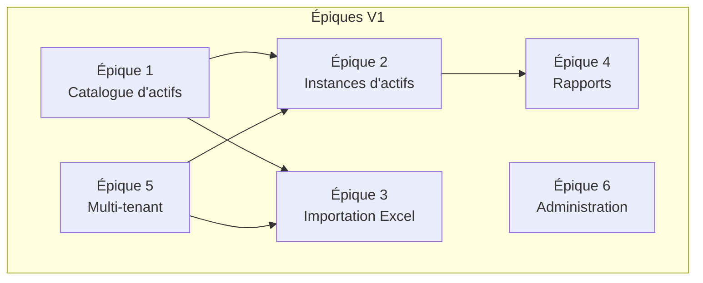

# Histoires Utilisateur — Système de Gestion des Actifs Municipaux

## Vue d'Ensemble des Épiques

---

## Épique 1 : Catalogue d'Actifs

### HU-1.1 — Consulter l'arborescence du catalogue

> **En tant qu'** opérateur municipal,  
> **Je veux** consulter l'arborescence hiérarchique du catalogue d'actifs,  
> **Afin de** comprendre la classification disponible et trouver le bon niveau pour mes actifs.

**Critères d'acceptation :**
- [ ] L'arborescence affiche les 8 niveaux hiérarchiques sous forme d'arbre dépliable
- [ ] Seules les entrées actives (sans date de fin) sont affichées
- [ ] Chaque nœud affiche son code et son nom
- [ ] L'arbre peut être filtré par service (niveau 1)
- [ ] Un filtre sur un service inexistant ou inactif retourne un arbre vide

---

### HU-1.2 — Créer une entrée dans le catalogue

> **En tant qu'** administrateur système,  
> **Je veux** créer une nouvelle entrée dans le catalogue à n'importe quel niveau,  
> **Afin d'** enrichir la taxonomie des actifs selon les besoins des municipalités.

**Critères d'acceptation :**
- [ ] Le formulaire permet de sélectionner le niveau hiérarchique
- [ ] Le parent est obligatoire pour les niveaux 2 à 8
- [ ] Le code respecte le format `^[A-Z0-9_]{1,50}$`
- [ ] Le code est unique au sein du niveau
- [ ] Le parent doit être actif (sans date de fin)
- [ ] En cas d'erreur, les détails sont affichés au niveau du champ

---

### HU-1.3 — Modifier une entrée du catalogue

> **En tant qu'** administrateur système,  
> **Je veux** modifier le nom d'une entrée du catalogue,  
> **Afin de** corriger ou mettre à jour la terminologie.

**Critères d'acceptation :**
- [ ] Seul le nom est modifiable (le code est immuable)
- [ ] Le nom doit contenir au moins 1 caractère non-espace et maximum 255 caractères
- [ ] Une tentative de modification du code retourne une erreur 400
- [ ] La modification est enregistrée avec mise à jour du timestamp

---

### HU-1.4 — Désactiver une entrée du catalogue

> **En tant qu'** administrateur système,  
> **Je veux** désactiver une entrée du catalogue qui n'est plus pertinente,  
> **Afin de** maintenir un catalogue propre sans perdre l'historique.

**Critères d'acceptation :**
- [ ] La désactivation positionne `end_date` au timestamp courant
- [ ] L'entrée disparaît de l'arborescence et des résultats de recherche
- [ ] La désactivation est refusée si l'entrée a des enfants actifs
- [ ] Un message d'erreur clair indique les enfants actifs à désactiver d'abord
- [ ] L'entrée peut être restaurée ultérieurement

---

### HU-1.5 — Restaurer une entrée du catalogue

> **En tant qu'** administrateur système,  
> **Je veux** restaurer une entrée du catalogue précédemment désactivée,  
> **Afin de** réactiver une classification qui redevient pertinente.

**Critères d'acceptation :**
- [ ] La restauration remet `end_date` à NULL
- [ ] L'entrée réapparaît dans l'arborescence
- [ ] La restauration est refusée si le parent est inactif
- [ ] Un message d'erreur indique que le parent doit être restauré en premier

---

## Épique 2 : Instances d'Actifs

### HU-2.1 — Créer une instance d'actif

> **En tant qu'** opérateur municipal,  
> **Je veux** créer une nouvelle instance d'actif physique,  
> **Afin d'** enregistrer un équipement dans l'inventaire de ma municipalité.

**Critères d'acceptation :**
- [ ] Le formulaire permet de saisir : code, nom, référence catalogue, municipalité, unité (optionnel), date d'installation (optionnel), numéro de série (optionnel), attributs (optionnel), notes (optionnel)
- [ ] Exactement une référence catalogue est requise (primaire XOR secondaire XOR tertiaire)
- [ ] Le code instance est unique au sein de la municipalité
- [ ] Le code respecte le format `^[A-Za-z0-9_\-]{1,50}$`
- [ ] La municipalité doit être active
- [ ] La référence catalogue doit être active
- [ ] Les attributs JSONB ne dépassent pas 10 Ko
- [ ] En cas d'erreur, tous les champs invalides sont signalés simultanément

---

### HU-2.2 — Consulter la liste des actifs

> **En tant qu'** opérateur municipal,  
> **Je veux** consulter la liste de mes actifs avec filtrage et pagination,  
> **Afin de** retrouver rapidement les informations sur mes équipements.

**Critères d'acceptation :**
- [ ] La liste est paginée (1 à 500 éléments par page, défaut 25)
- [ ] Le filtrage est possible par : niveaux hiérarchiques, municipalité, unité, attributs JSONB
- [ ] Le tri est possible par toute colonne affichée
- [ ] Seules les instances actives sont affichées par défaut
- [ ] La recherche textuelle fonctionne sur le nom et le code (insensible à la casse)

---

### HU-2.3 — Modifier une instance d'actif

> **En tant qu'** opérateur municipal,  
> **Je veux** modifier les informations d'une instance d'actif existante,  
> **Afin de** maintenir l'inventaire à jour.

**Critères d'acceptation :**
- [ ] Tous les champs sont modifiables sauf le code instance (immuable)
- [ ] Les mêmes règles de validation que la création s'appliquent
- [ ] Une tentative de modification du code retourne une erreur 400
- [ ] Le timestamp `updated_at` est mis à jour

---

### HU-2.4 — Désactiver une instance d'actif

> **En tant qu'** opérateur municipal,  
> **Je veux** désactiver une instance d'actif qui n'est plus en service,  
> **Afin de** retirer l'équipement de l'inventaire actif sans perdre son historique.

**Critères d'acceptation :**
- [ ] La désactivation positionne `end_date` au timestamp courant
- [ ] L'instance disparaît des listes et rapports par défaut
- [ ] Une confirmation est demandée avant la désactivation
- [ ] L'instance reste accessible pour consultation historique (si implémenté)

---

## Épique 3 : Importation Excel

### HU-3.1 — Importer un fichier Excel

> **En tant qu'** opérateur municipal,  
> **Je veux** importer un fichier Excel contenant des actifs en masse,  
> **Afin de** peupler rapidement le système avec mon inventaire existant.

**Critères d'acceptation :**
- [ ] Le système accepte les fichiers .xlsx uniquement (max 50 Mo, max 50 000 lignes)
- [ ] Le fichier doit contenir une feuille « Actifs » avec les colonnes requises
- [ ] L'opérateur sélectionne la municipalité cible
- [ ] Le traitement est toujours asynchrone via Celery, quelle que soit la taille du fichier
- [ ] La réponse est retournée uniquement à la fin du traitement complet
- [ ] Le code HTTP dépend du résultat : 200 (succès total), 207 (partiel), 422 (échec total)
- [ ] Le résultat affiche : créés, ignorés, erreurs (total = somme)

---

### HU-3.2 — Utiliser le mode simulation (dry-run)

> **En tant qu'** opérateur municipal,  
> **Je veux** simuler un import sans persister les données,  
> **Afin de** vérifier la qualité de mon fichier avant l'import réel.

**Critères d'acceptation :**
- [ ] L'option « Mode simulation » est disponible dans le formulaire d'import
- [ ] La validation complète est effectuée (mêmes règles que l'import réel)
- [ ] Aucune donnée n'est persistée en base
- [ ] Le résultat indique ce qui serait créé, ignoré et en erreur
- [ ] Un registre d'audit est tout de même créé (marqué dry-run)

---

### HU-3.3 — Consulter le rapport d'erreurs d'import

> **En tant qu'** opérateur municipal,  
> **Je veux** consulter le détail des erreurs d'un import,  
> **Afin de** corriger mon fichier Excel et relancer l'import.

**Critères d'acceptation :**
- [ ] Chaque erreur indique : numéro de ligne, colonne, valeur rejetée, message descriptif, sévérité
- [ ] Les erreurs sont triées par numéro de ligne croissant
- [ ] Maximum 1000 erreurs sont affichées (indicateur de troncature si dépassé)
- [ ] La sévérité distingue « erreur » (ligne non insérée) et « avertissement » (ligne insérée avec réserve)

---

### HU-3.4 — Gérer les doublons à l'import

> **En tant qu'** opérateur municipal,  
> **Je veux** choisir le comportement en cas de doublon de code instance,  
> **Afin de** contrôler si les doublons sont ignorés ou signalés comme erreurs.

**Critères d'acceptation :**
- [ ] L'option « Ignorer les doublons » est disponible dans le formulaire
- [ ] Si activée : les lignes avec un code existant sont ignorées (compteur « ignorés »)
- [ ] Si désactivée : les lignes avec un code existant sont comptées comme erreurs
- [ ] Le comportement est cohérent au sein d'un même import

---

### HU-3.5 — Consulter l'historique des imports

> **En tant qu'** opérateur municipal,  
> **Je veux** consulter l'historique de mes importations passées,  
> **Afin de** suivre les opérations effectuées et leurs résultats.

**Critères d'acceptation :**
- [ ] L'historique est paginé (1 à 100 éléments par page)
- [ ] Chaque entrée affiche : nom du fichier, statut, total, créés, ignorés, erreurs, dates
- [ ] L'historique est filtré par municipalité
- [ ] Les imports les plus récents apparaissent en premier

---

## Épique 4 : Rapports

### HU-4.1 — Générer un rapport d'inventaire

> **En tant que** gestionnaire public,  
> **Je veux** générer un rapport d'inventaire filtré sur les actifs de ma municipalité,  
> **Afin d'** avoir une vue claire de l'état du patrimoine.

**Critères d'acceptation :**
- [ ] Le rapport affiche la liste des instances avec tous leurs attributs
- [ ] Le filtrage est possible par : service, fonction, sous-fonction, type, municipalité, unité, discipline, plage de dates, recherche textuelle
- [ ] Les filtres s'appliquent en logique ET
- [ ] Les résultats sont paginés (défaut 25 par page)
- [ ] Un filtre sur un code inexistant retourne un résultat vide (pas d'erreur)

---

### HU-4.2 — Consulter un rapport par niveau hiérarchique

> **En tant qu'** analyste,  
> **Je veux** voir les actifs regroupés par un niveau hiérarchique de mon choix,  
> **Afin d'** analyser la répartition des actifs dans la classification.

**Critères d'acceptation :**
- [ ] L'utilisateur sélectionne le niveau de regroupement (Service, Fonction, etc.)
- [ ] Chaque groupe affiche : code du niveau, nom du niveau, nombre d'actifs
- [ ] Les filtres supplémentaires sont applicables
- [ ] Les groupes vides ne sont pas affichés

---

### HU-4.3 — Consulter un rapport résumé

> **En tant que** gestionnaire public,  
> **Je veux** voir un résumé agrégé des actifs par hiérarchie et par municipalité,  
> **Afin d'** avoir une vue synthétique pour la planification.

**Critères d'acceptation :**
- [ ] Le résumé affiche les compteurs par niveau hiérarchique et par tenant
- [ ] Les filtres sont applicables pour affiner le résumé
- [ ] Le total général est affiché

---

### HU-4.4 — Exporter un rapport en Excel

> **En tant que** gestionnaire public,  
> **Je veux** exporter un rapport en format Excel,  
> **Afin de** partager les données avec des collègues qui n'ont pas accès au système.

**Critères d'acceptation :**
- [ ] Le fichier .xlsx contient les en-têtes de colonnes et toutes les lignes filtrées
- [ ] L'export applique les mêmes filtres que l'affichage (sans pagination)
- [ ] Les exports > 1000 lignes sont traités de manière asynchrone
- [ ] Le fichier est valide et ouvrable dans Excel

---

### HU-4.5 — Exporter un rapport en PDF

> **En tant que** gestionnaire public,  
> **Je veux** exporter un rapport en format PDF,  
> **Afin de** produire un document formel pour les présentations et archives.

**Critères d'acceptation :**
- [ ] Le PDF contient : titre du rapport, en-têtes de colonnes, données tabulaires, numéros de page
- [ ] L'export applique les mêmes filtres que l'affichage
- [ ] Les exports > 1000 lignes sont traités de manière asynchrone
- [ ] En cas d'erreur, aucun fichier partiel n'est produit

---

## Épique 5 : Multi-Tenant

### HU-5.1 — Créer une municipalité

> **En tant qu'** administrateur système,  
> **Je veux** créer une nouvelle municipalité dans le système,  
> **Afin de** permettre à une nouvelle ville d'utiliser la plateforme.

**Critères d'acceptation :**
- [ ] Le code tenant est unique globalement
- [ ] Le code respecte le format `^[A-Z0-9_]{1,50}$`
- [ ] Le nom est obligatoire (1-255 caractères)
- [ ] La municipalité est créée avec le statut actif
- [ ] Un code déjà existant retourne une erreur 400

---

### HU-5.2 — Isolation des données par municipalité

> **En tant qu'** opérateur municipal,  
> **Je veux** que mes données soient isolées de celles des autres municipalités,  
> **Afin de** garantir la confidentialité et l'intégrité de mon inventaire.

**Critères d'acceptation :**
- [ ] Les requêtes filtrées par tenant ne retournent que les instances de ce tenant
- [ ] Le même code instance peut exister dans deux municipalités différentes
- [ ] L'import associe toutes les instances au tenant spécifié
- [ ] Les rapports sont filtrables par municipalité

---

### HU-5.3 — Gérer les unités organisationnelles

> **En tant qu'** administrateur système,  
> **Je veux** créer des unités organisationnelles au sein d'une municipalité,  
> **Afin de** permettre une organisation plus fine des actifs (par site, district, etc.).

**Critères d'acceptation :**
- [ ] Le code unité est unique globalement
- [ ] L'unité est rattachée à une municipalité
- [ ] Le nom et la localisation sont renseignables
- [ ] Les instances peuvent être associées à une unité (optionnel)

---

## Épique 6 : Administration

### HU-6.1 — Vérifier la santé du système

> **En tant qu'** administrateur système,  
> **Je veux** vérifier que le système fonctionne correctement,  
> **Afin de** détecter rapidement les problèmes de connectivité.

**Critères d'acceptation :**
- [ ] L'endpoint `/api/v1/health` retourne 200 si la base de données est accessible
- [ ] L'endpoint retourne 503 si la base de données est inaccessible
- [ ] La réponse inclut un code d'erreur et un message descriptif

---

### HU-6.2 — Consulter la documentation API

> **En tant que** développeur intégrateur,  
> **Je veux** consulter la documentation auto-générée de l'API,  
> **Afin de** comprendre les endpoints disponibles et leurs paramètres.

**Critères d'acceptation :**
- [ ] La documentation OpenAPI est accessible à `/docs` (Swagger UI)
- [ ] La documentation alternative est accessible à `/redoc`
- [ ] Tous les endpoints sont documentés avec leurs schémas de requête et réponse
- [ ] Les codes d'erreur sont documentés

---

### HU-6.3 — Télécharger le template d'import

> **En tant qu'** opérateur municipal,  
> **Je veux** télécharger un template Excel vierge,  
> **Afin de** connaître le format attendu pour l'importation en masse.

**Critères d'acceptation :**
- [ ] Le template est un fichier .xlsx valide
- [ ] Il contient une feuille « Actifs » avec toutes les colonnes requises
- [ ] Les en-têtes correspondent exactement aux noms attendus par le système
- [ ] Le template est téléchargeable via l'interface et via l'API
