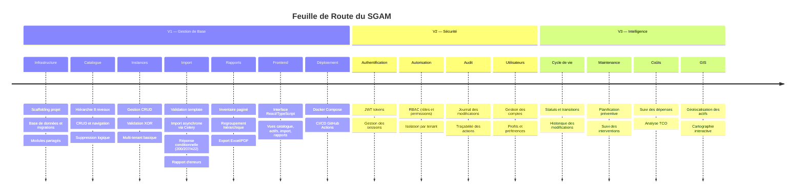
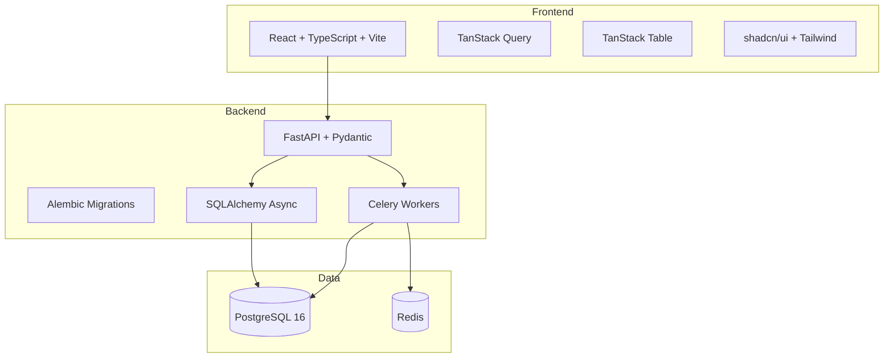
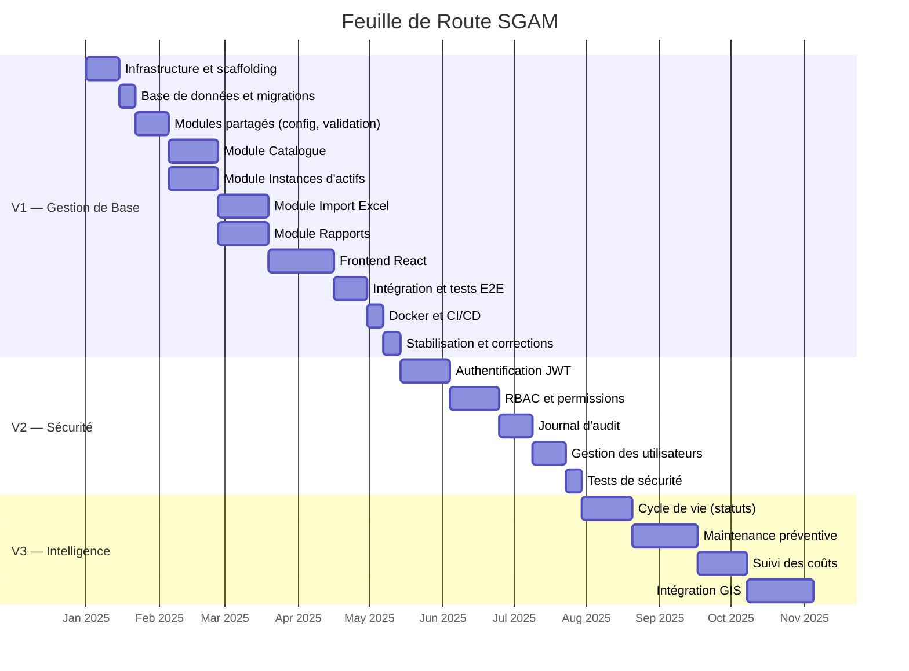

# Feuille de Route — Système de Gestion des Actifs Municipaux

## Vue d'Ensemble des Versions

---

## V1 — Gestion de Base

### Objectif

Livrer un système fonctionnel permettant la gestion centralisée des actifs municipaux avec importation Excel et rapports exportables.

### Fonctionnalités Détaillées

| Module | Fonctionnalité | Priorité | Complexité |
|--------|---------------|----------|------------|
| **Catalogue** | Hiérarchie 8 niveaux (CRUD) | Critique | Élevée |
| **Catalogue** | Navigation arborescente | Critique | Moyenne |
| **Catalogue** | Filtrage par service | Élevée | Faible |
| **Catalogue** | Suppression logique avec contrôle des enfants | Élevée | Moyenne |
| **Instances** | Création manuelle avec validation | Critique | Moyenne |
| **Instances** | Consultation paginée et filtrée | Critique | Moyenne |
| **Instances** | Modification (code immuable) | Élevée | Faible |
| **Instances** | Désactivation (soft delete) | Élevée | Faible |
| **Instances** | Attributs JSONB flexibles | Moyenne | Faible |
| **Import** | Validation du template Excel | Critique | Moyenne |
| **Import** | Import asynchrone via Celery (toute taille) | Critique | Élevée |
| **Import** | Réponse HTTP conditionnelle (200/207/422) | Élevée | Moyenne |
| **Import** | Mode simulation (dry-run) | Élevée | Moyenne |
| **Import** | Rapport d'erreurs détaillé | Élevée | Moyenne |
| **Import** | Gestion des doublons | Moyenne | Faible |
| **Import** | Historique des imports | Moyenne | Faible |
| **Rapports** | Inventaire paginé avec filtres | Critique | Moyenne |
| **Rapports** | Regroupement par niveau hiérarchique | Élevée | Moyenne |
| **Rapports** | Résumé agrégé | Élevée | Moyenne |
| **Rapports** | Export Excel (.xlsx) | Élevée | Moyenne |
| **Rapports** | Export PDF | Élevée | Moyenne |
| **Rapports** | Export asynchrone (> 1000 lignes) | Moyenne | Moyenne |
| **Multi-tenant** | Gestion des municipalités | Critique | Faible |
| **Multi-tenant** | Isolation des données | Critique | Moyenne |
| **Multi-tenant** | Unités organisationnelles | Moyenne | Faible |
| **Frontend** | Interface catalogue (arbre) | Critique | Élevée |
| **Frontend** | Interface instances (tableau, formulaires) | Critique | Élevée |
| **Frontend** | Interface import (upload, résultats) | Élevée | Moyenne |
| **Frontend** | Interface rapports (filtres, export) | Élevée | Moyenne |
| **Infra** | Docker Compose (dev + prod) | Critique | Moyenne |
| **Infra** | CI/CD (lint, test, build, deploy) | Élevée | Moyenne |
| **Infra** | Health check et documentation API | Élevée | Faible |

### Architecture Technique V1

---

## V2 — Sécurité et Multi-Tenant Avancé

### Objectif

Ajouter l'authentification, l'autorisation basée sur les rôles et le journal d'audit pour sécuriser l'accès et tracer les actions.

### Fonctionnalités Planifiées

| Module | Fonctionnalité | Description |
|--------|---------------|-------------|
| **Authentification** | Connexion JWT | Tokens d'accès et de rafraîchissement |
| **Authentification** | Gestion des sessions | Expiration, révocation |
| **Authentification** | Réinitialisation de mot de passe | Flux par email |
| **Autorisation** | Rôles prédéfinis | Administrateur, Opérateur, Lecteur |
| **Autorisation** | Permissions par module | Catalogue, Instances, Import, Rapports |
| **Autorisation** | Isolation par tenant | Un utilisateur ne voit que les données de son tenant |
| **Audit** | Journal des modifications | Qui, quoi, quand pour chaque changement |
| **Audit** | Historique des connexions | Tentatives réussies et échouées |
| **Utilisateurs** | Gestion des comptes | Création, modification, désactivation |
| **Utilisateurs** | Profils | Préférences, langue, notifications |

### Prérequis

- V1 complète et stable
- Définition des rôles et permissions avec les parties prenantes

---

## V3 — Cycle de Vie et Intelligence

### Objectif

Enrichir le système avec le suivi du cycle de vie des actifs, la planification de maintenance, l'analyse des coûts et la géolocalisation.

### Fonctionnalités Planifiées

| Module | Fonctionnalité | Description |
|--------|---------------|-------------|
| **Cycle de vie** | Machine à états | Statuts : Planifié → Actif → En maintenance → Hors service → Retiré |
| **Cycle de vie** | Historique des transitions | Traçabilité complète des changements de statut |
| **Cycle de vie** | Durée de vie estimée | Calcul basé sur le type d'actif et la date d'installation |
| **Maintenance** | Planification préventive | Calendrier de maintenance par type d'actif |
| **Maintenance** | Ordres de travail | Création, assignation, suivi |
| **Maintenance** | Historique des interventions | Registre de toutes les maintenances effectuées |
| **Coûts** | Suivi des dépenses | Coûts d'acquisition, maintenance, remplacement |
| **Coûts** | Analyse TCO | Coût total de possession par actif et par catégorie |
| **Coûts** | Budget prévisionnel | Projection des dépenses futures |
| **GIS** | Géolocalisation | Coordonnées GPS par instance |
| **GIS** | Cartographie | Visualisation sur carte interactive |
| **GIS** | Zones géographiques | Regroupement spatial des actifs |

### Prérequis

- V2 complète (sécurité et audit)
- Données de géolocalisation disponibles
- Définition des workflows de maintenance

---

## Diagramme de Gantt Prévisionnel

---

## Jalons Clés

| Jalon | Version | Description | Date Cible |
|-------|---------|-------------|-----------|
| M1 | V1 | Infrastructure et base de données opérationnelles | TBD |
| M2 | V1 | Modules Catalogue et Instances fonctionnels | TBD |
| M3 | V1 | Import Excel et Rapports opérationnels | TBD |
| M4 | V1 | Frontend complet et intégré | TBD |
| M5 | V1 | **Livraison V1** — Système en production | TBD |
| M6 | V2 | Authentification et RBAC déployés | TBD |
| M7 | V2 | **Livraison V2** — Sécurité complète | TBD |
| M8 | V3 | Cycle de vie et maintenance | TBD |
| M9 | V3 | **Livraison V3** — Intelligence complète | TBD |

---

## Critères de Passage entre Versions

### V1 → V2

- [ ] Tous les modules V1 sont fonctionnels et testés
- [ ] Les tests automatisés couvrent > 80% du code
- [ ] Le déploiement Docker est opérationnel
- [ ] Au moins 2 municipalités utilisent le système
- [ ] La documentation API est complète

### V2 → V3

- [ ] L'authentification JWT est en production
- [ ] Le RBAC est configuré et testé
- [ ] Le journal d'audit enregistre toutes les actions
- [ ] Les tests de sécurité sont passés
- [ ] Les utilisateurs sont formés aux nouvelles fonctionnalités
