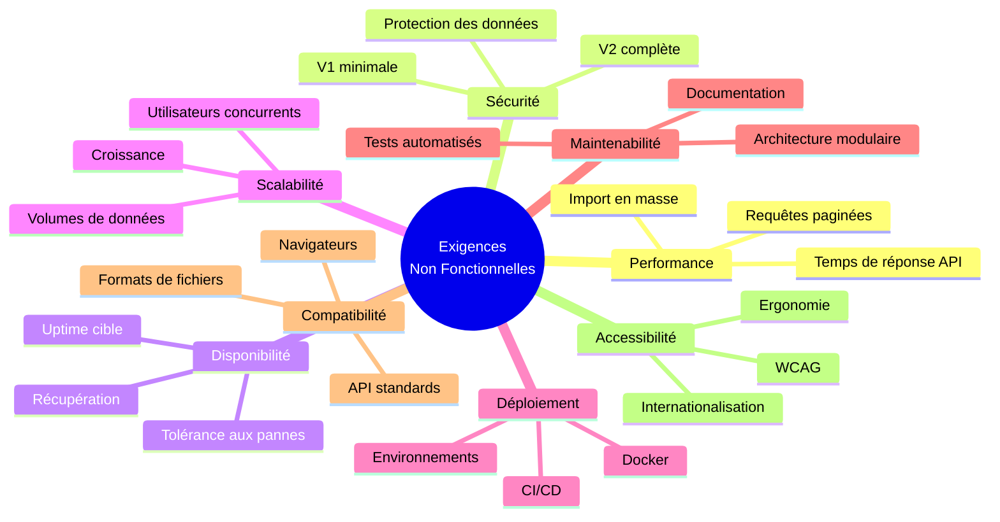
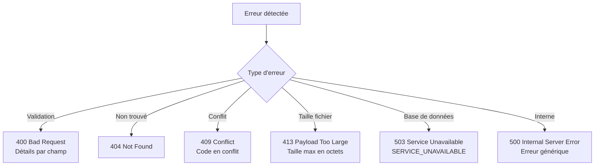
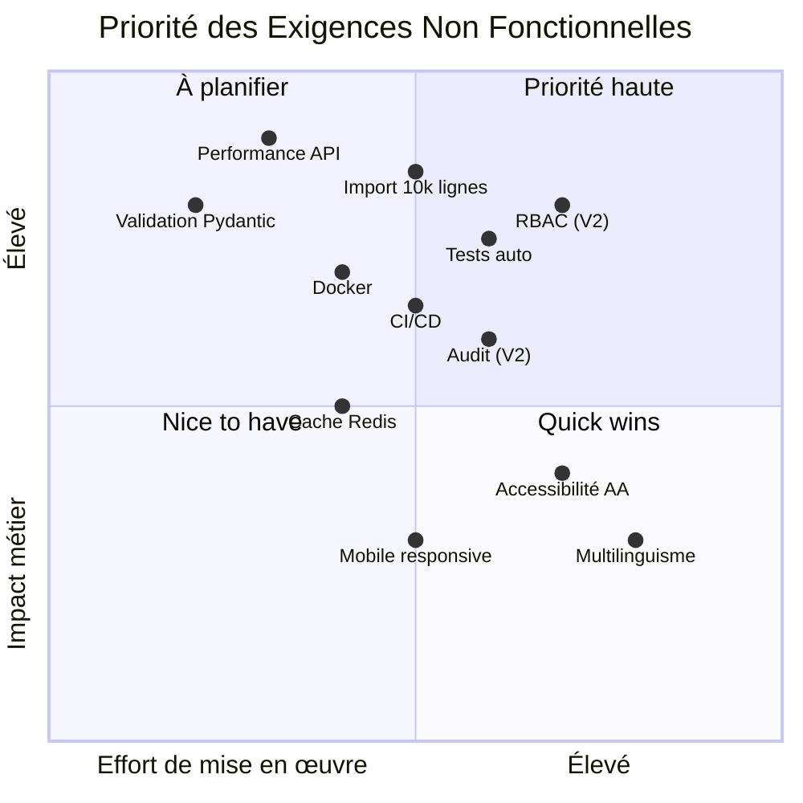

# Exigences Non Fonctionnelles — Système de Gestion des Actifs Municipaux

## Vue d'Ensemble

---

## 1. Performance

### 1.1 Temps de Réponse API

| Métrique | Cible | Conditions |
|----------|-------|-----------|
| Requête sur ressource unique | < 500 ms | Base connectée, < 100 requêtes concurrentes |
| Liste paginée | < 2 000 ms | Base connectée, < 100 requêtes concurrentes |
| Recherche plein texte | < 2 000 ms | Index trigramme actif |
| Health check | < 100 ms | Conditions normales |

### 1.2 Import Excel

| Métrique | Cible | Conditions |
|----------|-------|-----------|
| Import (toute taille) | Réponse à la fin du traitement | Traitement asynchrone via Celery |
| Import de 10 000 lignes | < 30 secondes | Fichier valide, réseau local |
| Import de 50 000 lignes | < 3 minutes | Fichier valide, traitement asynchrone |

### 1.3 Rapports et Exports

| Métrique | Cible | Conditions |
|----------|-------|-----------|
| Génération rapport paginé | < 2 000 ms | Filtres appliqués |
| Export Excel (≤ 1000 lignes) | < 10 secondes | Synchrone |
| Export PDF (≤ 1000 lignes) | < 15 secondes | Synchrone |
| Export asynchrone (> 1000 lignes) | Retour < 2 secondes | Accusé de réception |

### 1.4 Base de Données

| Métrique | Cible |
|----------|-------|
| Pool de connexions | 5 connexions (extensible à 15) |
| Requêtes hiérarchiques (CTE) | < 500 ms pour arbre complet |
| Index partiels | Actifs sur `end_date IS NULL` |

---

## 2. Sécurité

### 2.1 V1 — Sécurité Minimale

| Exigence | Description |
|----------|-------------|
| ENF-SEC-01 | Validation de toutes les entrées via Pydantic (injection SQL impossible) |
| ENF-SEC-02 | CORS configuré avec origines autorisées explicites |
| ENF-SEC-03 | Limitation de débit (rate limiting) sur l'endpoint d'upload |
| ENF-SEC-04 | Validation de la taille des fichiers (max 50 Mo) |
| ENF-SEC-05 | Pas de stockage de secrets en clair dans le code source |
| ENF-SEC-06 | Variables d'environnement pour toute configuration sensible |
| ENF-SEC-07 | Requêtes paramétrées (SQLAlchemy ORM) — pas de SQL brut concaténé |

### 2.2 V2 — Sécurité Complète

| Exigence | Description |
|----------|-------------|
| ENF-SEC-08 | Authentification JWT avec tokens d'accès et de rafraîchissement |
| ENF-SEC-09 | Hachage des mots de passe (bcrypt/argon2) |
| ENF-SEC-10 | RBAC avec rôles : Administrateur, Opérateur, Lecteur |
| ENF-SEC-11 | Isolation des données par tenant au niveau de l'API |
| ENF-SEC-12 | Journal d'audit de toutes les actions sensibles |
| ENF-SEC-13 | Protection CSRF pour les opérations d'écriture |
| ENF-SEC-14 | En-têtes de sécurité HTTP (HSTS, X-Content-Type-Options, etc.) |
| ENF-SEC-15 | Expiration et révocation des sessions |

### 2.3 Protection des Données

| Exigence | Description |
|----------|-------------|
| ENF-SEC-16 | Suppression logique uniquement (conservation des données) |
| ENF-SEC-17 | Hash SHA-256 des fichiers importés (traçabilité) |
| ENF-SEC-18 | Pas de données personnelles dans les logs |
| ENF-SEC-19 | Chiffrement TLS en transit (HTTPS obligatoire en production) |

---

## 3. Disponibilité et Fiabilité

### 3.1 Objectifs de Disponibilité

| Métrique | Cible V1 | Cible V2+ |
|----------|----------|-----------|
| Uptime | 99.5% | 99.9% |
| Temps d'arrêt planifié max | 4h/mois | 1h/mois |
| RTO (Recovery Time Objective) | 1 heure | 15 minutes |
| RPO (Recovery Point Objective) | 1 heure | 5 minutes |

### 3.2 Fiabilité

| Exigence | Description |
|----------|-------------|
| ENF-FIA-01 | Health check endpoint (`/api/v1/health`) pour monitoring |
| ENF-FIA-02 | Réponse 503 avec message descriptif en cas de panne base de données |
| ENF-FIA-03 | Rollback par lot en cas d'erreur d'import (pas de corruption partielle) |
| ENF-FIA-04 | Transactions atomiques pour les opérations d'écriture |
| ENF-FIA-05 | Gestion des conflits de concurrence (409 Conflict) |
| ENF-FIA-06 | Pas de fichier partiel ou corrompu en cas d'erreur d'export |
| ENF-FIA-07 | Redémarrage automatique des conteneurs en cas de crash |

### 3.3 Gestion des Erreurs

---

## 4. Scalabilité

### 4.1 Volumes de Données Supportés

| Dimension | Cible V1 | Cible V3 |
|-----------|----------|----------|
| Municipalités (tenants) | 10 | 100 |
| Instances d'actifs par tenant | 100 000 | 1 000 000 |
| Entrées catalogue (total) | 10 000 | 50 000 |
| Imports par jour | 50 | 500 |
| Taille maximale fichier import | 50 Mo | 100 Mo |
| Lignes par import | 50 000 | 100 000 |

### 4.2 Utilisateurs Concurrents

| Métrique | Cible V1 | Cible V2+ |
|----------|----------|-----------|
| Utilisateurs simultanés | 50 | 500 |
| Requêtes API par seconde | 100 | 1 000 |
| Imports simultanés | 5 | 20 |
| Exports simultanés | 10 | 50 |

### 4.3 Stratégies de Scalabilité

| Stratégie | Description | Version |
|-----------|-------------|---------|
| Index partiels | Requêtes uniquement sur enregistrements actifs | V1 |
| Pagination obligatoire | Pas de requêtes non bornées | V1 |
| Traitement asynchrone | Celery pour imports/exports volumineux | V1 |
| Pool de connexions | SQLAlchemy avec pool configurable | V1 |
| Cache Redis | Résultats fréquents (arbre catalogue) | V2 |
| Réplicas en lecture | PostgreSQL read replicas | V3 |
| Partitionnement | Tables d'instances par tenant | V3 |

---

## 5. Déploiement

### 5.1 Conteneurisation Docker

| Exigence | Description |
|----------|-------------|
| ENF-DEP-01 | Tous les services conteneurisés (API, Worker, Frontend, DB, Redis) |
| ENF-DEP-02 | Images multi-étapes (build + runtime) pour taille optimale |
| ENF-DEP-03 | Docker Compose pour développement local (hot reload) |
| ENF-DEP-04 | Docker Compose pour production (Nginx, TLS, volumes persistants) |
| ENF-DEP-05 | Variables d'environnement pour toute configuration |
| ENF-DEP-06 | Fichier `.env.example` documentant toutes les variables requises |

### 5.2 CI/CD (GitHub Actions)

| Étape | Description | Déclencheur |
|-------|-------------|-------------|
| Lint | Vérification du style (ruff) | Push / PR |
| Type check | Vérification des types (mypy) | Push / PR |
| Tests | Exécution pytest avec PostgreSQL de test | Push / PR |
| Couverture | Rapport de couverture (pytest-cov) | Push / PR |
| Build | Construction des images Docker | Merge sur main |
| Deploy | Déploiement sur environnement cible | Tag de release |

### 5.3 Environnements

| Environnement | Usage | Configuration |
|---------------|-------|---------------|
| Développement | Développement local | Docker Compose dev, hot reload, données de test |
| Test | Tests automatisés CI | PostgreSQL éphémère, données de seed |
| Staging | Validation pré-production | Configuration production, données anonymisées |
| Production | Utilisation réelle | TLS, backups, monitoring |

---

## 6. Maintenabilité

### 6.1 Architecture

| Exigence | Description |
|----------|-------------|
| ENF-MAI-01 | Architecture monolithe modulaire (modules indépendants) |
| ENF-MAI-02 | Séparation claire : Router → Service → Repository → Model |
| ENF-MAI-03 | Modules isolés : Catalogue, Instances, Import, Rapports |
| ENF-MAI-04 | Dépendances injectées (FastAPI Depends) |
| ENF-MAI-05 | Configuration centralisée (Pydantic Settings) |

### 6.2 Tests Automatisés

| Type de Test | Couverture Cible | Outils |
|-------------|-----------------|--------|
| Tests unitaires | > 80% du code métier | pytest |
| Tests de propriété | Invariants critiques | hypothesis |
| Tests d'intégration | Flux complets API | httpx + pytest-asyncio |
| Tests de validation | Toutes les règles | pytest |

### 6.3 Qualité du Code

| Exigence | Description |
|----------|-------------|
| ENF-MAI-06 | Linting automatique (ruff) |
| ENF-MAI-07 | Vérification de types (mypy en mode strict) |
| ENF-MAI-08 | Migrations versionnées (Alembic) |
| ENF-MAI-09 | Documentation API auto-générée (OpenAPI) |
| ENF-MAI-10 | Commentaires de code pour la logique complexe |

### 6.4 Documentation

| Document | Contenu |
|----------|---------|
| README.md | Installation, démarrage rapide, architecture |
| API Docs | Auto-générée via OpenAPI (/docs, /redoc) |
| DECISIONS.md | Décisions architecturales et justifications |
| CHANGELOG.md | Historique des modifications par version |

---

## 7. Compatibilité Navigateurs

### 7.1 Navigateurs Supportés

| Navigateur | Version Minimale | Support |
|-----------|-----------------|---------|
| Google Chrome | 90+ | Complet |
| Mozilla Firefox | 88+ | Complet |
| Microsoft Edge | 90+ | Complet |
| Safari | 14+ | Complet |
| Internet Explorer | — | Non supporté |

### 7.2 Résolutions d'Écran

| Catégorie | Résolution | Support |
|-----------|-----------|---------|
| Desktop | 1280×720 et plus | Complet (optimisé) |
| Tablette | 768×1024 | Fonctionnel (responsive) |
| Mobile | 375×667 | Consultation uniquement (V2) |

### 7.3 Formats de Fichiers

| Format | Usage | Bibliothèque |
|--------|-------|--------------|
| .xlsx (Excel) | Import et export | openpyxl (lecture), xlsxwriter (écriture) |
| .pdf | Export rapports | reportlab |
| .json | API REST | FastAPI natif |

---

## 8. Accessibilité

### 8.1 Conformité

| Exigence | Description |
|----------|-------------|
| ENF-ACC-01 | Interface conforme aux principes WCAG 2.1 niveau AA (cible) |
| ENF-ACC-02 | Navigation au clavier pour toutes les fonctionnalités principales |
| ENF-ACC-03 | Contraste de couleurs suffisant (ratio 4.5:1 minimum pour le texte) |
| ENF-ACC-04 | Textes alternatifs pour les éléments visuels |
| ENF-ACC-05 | Messages d'erreur associés aux champs de formulaire (aria-describedby) |
| ENF-ACC-06 | Structure sémantique HTML (headings, landmarks, labels) |

> **Note** : La conformité WCAG complète nécessite des tests manuels avec des technologies d'assistance et une revue d'accessibilité par un expert.

### 8.2 Ergonomie

| Exigence | Description |
|----------|-------------|
| ENF-ERG-01 | Messages d'erreur clairs et en français |
| ENF-ERG-02 | Feedback visuel pour les actions en cours (chargement, progression) |
| ENF-ERG-03 | Confirmation avant les actions destructives (désactivation) |
| ENF-ERG-04 | Navigation cohérente entre les modules |
| ENF-ERG-05 | Formulaires avec validation en temps réel |

### 8.3 Internationalisation

| Exigence | Description |
|----------|-------------|
| ENF-I18N-01 | Interface utilisateur en français (V1) |
| ENF-I18N-02 | Terminologie du domaine en français dans le modèle de données |
| ENF-I18N-03 | Architecture prête pour le multilinguisme (V2+) |
| ENF-I18N-04 | Formats de date et nombres selon les conventions françaises |

---

## Matrice de Priorité

---

## Résumé des Seuils Critiques

| Catégorie | Seuil | Conséquence si non respecté |
|-----------|-------|----------------------------|
| Temps de réponse API | > 2 secondes | Dégradation de l'expérience utilisateur |
| Import 10 000 lignes | > 30 secondes | Timeout ou abandon par l'utilisateur |
| Uptime | < 99.5% | Perte de confiance des municipalités |
| Couverture de tests | < 80% | Risque de régressions |
| Taille fichier import | > 50 Mo | Rejet automatique |
| Erreurs d'import | > 1000 | Troncature du rapport d'erreurs |
